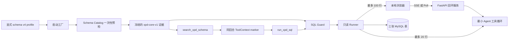
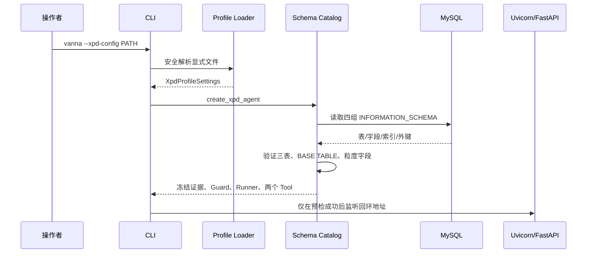
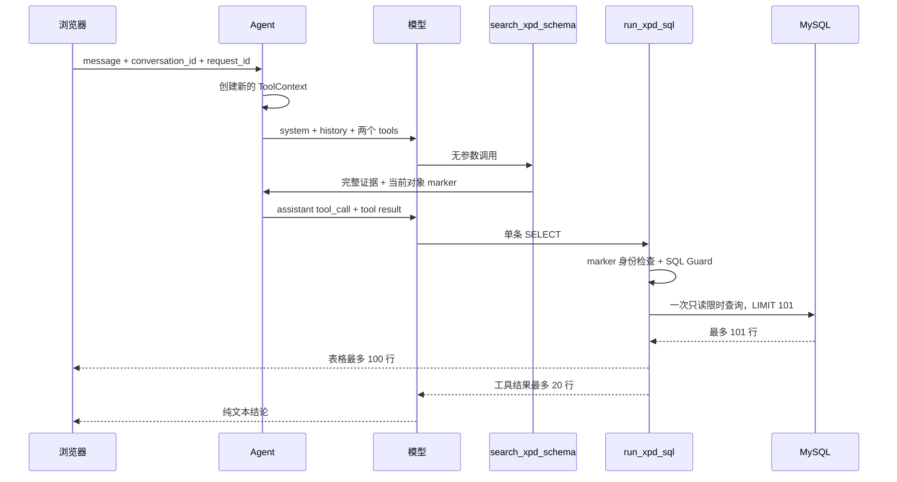

# Vanna XPD 专用化架构与代码设计（002）

## 1. 设计结论

架构采用“薄通用核心 + 厚 XPD 契约”的单体进程。保留通用核心的原因是 Agent 工具循环、消息轮次和组件序列化已经形成稳定边界；所有可扩展集成和旁路能力均被删除。002 是当前有效设计，001 中的登录、权限组、Flask、通用 CLI 和 optional extras 不再适用。



## 2. 保留的代码边界

```text
src/vanna/
├── __init__.py              # 两个公共 Python API
├── __main__.py              # vanna CLI
├── core/                    # Agent/LLM/Tool/会话/组件最小协议
├── components/              # 文本、表格、状态、输入状态
└── integrations/xpd/
    ├── config.py            # 外部 profile 的严格只读投影
    ├── contract.py          # 三表、粒度、关系、指标版本
    ├── schema.py            # INFORMATION_SCHEMA 启动预检
    ├── sql_guard.py         # sqlglot AST/scope 安全策略
    ├── runner.py            # 只读事务、超时、限行
    ├── tools.py             # 唯一两项工具
    ├── llm.py               # 异步 Chat Completions 适配
    ├── workflow.py          # 欢迎页与 help
    ├── factory.py           # 唯一装配入口
    ├── web.py               # 唯一 FastAPI surface
    ├── cli.py               # 唯一 CLI surface
    └── static/              # 零依赖本地 JS/CSS
```

被删除的目录包括通用 `capabilities`、`tools`、`servers`、`legacy`、`examples`、其他 `integrations`、通用前端、notebooks、papers 和对应测试。

## 3. 启动时序



`XpdSchemaCatalog.load()` 首次成功后直接返回缓存对象，不提供普通刷新参数。Guard 和 Search Tool 持有同一个 Catalog/证据，Run Tool 通过对象身份而非仅版本字符串验证 marker。

## 4. 单回合执行时序



同一回合的工具调用严格顺序执行，因为并行工具调用在模型 payload 中关闭。下一条用户消息一定创建新 Context，所以历史中的 Schema 文本不能满足门禁。

## 5. 配置与证据模型

Loader 使用 `yaml.SafeLoader` 的严格映射构造器，先拒绝重复键、anchor、alias、merge 和占位符，再只投影四个获批顶层字段。嵌套模型 `extra=forbid`、`strict=true`、`frozen=true`；密钥为 `SecretStr`。

Schema 证据包含：

- 契约版本和数据库名；
- 三表字段名、类型、顺序、可空性和清理后的注释；
- 主键、索引、真实外键；
- 固定粒度和字段存在时才发布的指标；
- 字段存在时补充的唯一逻辑关系。

数据库注释作为不可信提示输入处理：删除控制/格式字符、压缩空白并截断到 500 字符。

## 6. SQL Guard 与 Runner

Guard 使用 `sqlglot` MySQL AST 和 scope。它要求单个 `Select` 根节点，验证每个物理 source、字段限定、未限定字段歧义和 JOIN 等值关系；拒绝写/管理节点、跨库、危险函数、变量、可执行注释和投影星号。CTE 输出列从 scope 读取；派生表 JOIN 不在 v1 合同内。

Runner 先在事件循环线程完成 Guard，再把阻塞 DB-API 操作交给 `asyncio.to_thread`。执行顺序固定为：连接阶段有限重试、设置只读事务、设置服务端超时、启动只读事务、执行外层 `LIMIT 101` 查询一次、读取、rollback、关闭。

Decimal 转字符串，日期时间转 ISO 8601，二进制转 `base64:` 文本。数据库原始异常只作为 exception chain，不进入 Tool 或 HTTP 响应。

## 7. HTTP 合同

请求模型：

```json
{
  "message": "最近 7 天按日汇总支付金额",
  "conversation_id": "conv_optional",
  "request_id": "req_optional"
}
```

SSE 的每个 frame 是 `data: <XpdChatChunk>`，成功结束为 `data: [DONE]`。Poll 返回 `chunks` 数组以及统一的 conversation/request ID。Chunk 同时包含 rich 和可选 simple 表示；前端只用安全 DOM API 和 `textContent`。

浏览器在 dispatch 前根据 `ReadableStream`/`TextDecoder` 能力确定传输。SSE 中断不会触发 Poll，因此数据库副作用虽然已被只读化，也不会发生重复查询和重复计费。

FastAPI 禁用 schema/docs 路由，不安装 CORS 中间件，不读写 Cookie。响应统一添加：

- `Content-Security-Policy: default-src 'self' ...`
- `X-Content-Type-Options: nosniff`
- `Referrer-Policy: no-referrer`

## 8. 错误合同

| 代码 | 来源 |
| --- | --- |
| `xpd_config_invalid` | profile 解析或验证失败 |
| `xpd_schema_unavailable` | 启动元数据预检失败 |
| `xpd_sql_rejected` | Schema 门禁或 SQL 策略拒绝 |
| `xpd_query_timeout` | 查询超时/被服务端中止 |
| `xpd_database_unavailable` | 查询前连接重试耗尽 |
| `xpd_query_failed` | 其他数据库执行失败 |
| `xpd_model_unavailable` | 模型调用失败 |
| `xpd_request_invalid` | HTTP payload 不合法 |
| `xpd_internal_error` | HTTP 层未预期失败 |

未知异常的 HTTP 响应固定为通用消息，日志不拼接 exception 文本、SQL、profile、密钥或结果。

## 9. 状态、并发与部署

会话只保存在单进程内存中，并用固定内部用户 ID 做隔离键。该 ID 不是认证身份。进程重启会清空会话；多 worker 之间不会共享状态，因此运行命令不开放 worker 数配置。

当前部署合同是一个本地进程、一个可信操作者。未来若增加公网、多用户、更多表、关系或指标，必须新建需求并升级契约；不能在本架构上绕过 host 白名单或动态注册工具。

## 10. 公共边界

根包只导出：

```python
load_xpd_profile(path) -> XpdProfileSettings
create_xpd_agent(settings) -> Agent
```

其余 `vanna.core` 和 `vanna.integrations.xpd` 对象是实现细节，可在 3.x 内调整。包保留 Flit 源码构建能力用于本地安装和 CI 校验，但没有公共发布工作流。
