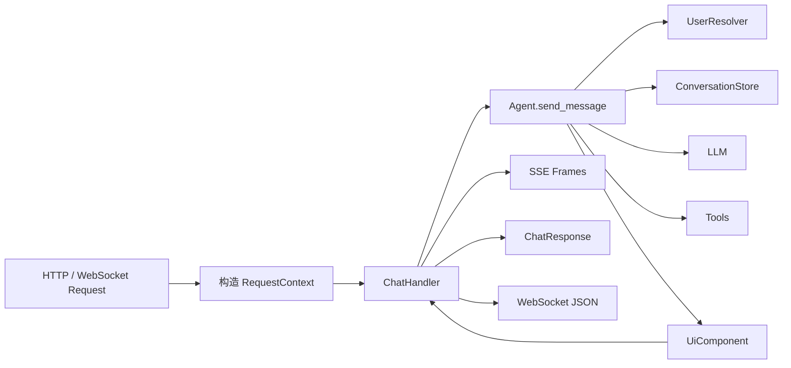

# Vanna 项目 HTTP API 总览

本文基于当前仓库实现，汇总 Vanna 对外提供的 HTTP、SSE 和 WebSocket 接口。重点说明 V2 Agent Server 的统一协议，并列出独立的 Legacy Flask `/api/v0/*` 兼容接口。

> 本文中的“API”指项目自带 Server 暴露的网络接口，不包含 `Agent`、`Tool`、`ConversationStore` 等 Python 编程接口。`chat_sse` 的组件协议、数据量边界和对话历史细节见 [`chat_sse` 专项说明](./chat_sse.md)。

实现位置：

- [V2 公共请求、响应模型](../../src/vanna/servers/base/models.py)
- [V2 公共 ChatHandler](../../src/vanna/servers/base/chat_handler.py)
- [FastAPI 路由](../../src/vanna/servers/fastapi/routes.py)
- [FastAPI Server](../../src/vanna/servers/fastapi/app.py)
- [Flask 路由](../../src/vanna/servers/flask/routes.py)
- [Flask Server](../../src/vanna/servers/flask/app.py)
- [Legacy Flask API](../../src/vanna/legacy/flask/__init__.py)

## 1. API 体系与选择

项目中存在两套相互独立的 Server API：

| API 体系 | 路径 | Server 类 | 用途 | 建议 |
| --- | --- | --- | --- | --- |
| V2 Agent API | `/api/vanna/v2/*` | `VannaFastAPIServer`、`VannaFlaskServer` | 对话、工具调用、Rich Component 和多轮上下文 | 新项目优先使用 |
| Legacy Flask API | `/api/v0/*` | `VannaFlaskAPI`、`VannaFlaskApp` | 旧版 Text-to-SQL 分步调用、训练数据和函数管理 | 仅用于旧系统兼容 |

两套接口不会同时自动注册：

- 创建 `VannaFastAPIServer` 或 `VannaFlaskServer`，只会得到 V2 接口。
- 创建 `vanna.legacy.flask.VannaFlaskAPI` 或 `VannaFlaskApp`，只会得到 Legacy 接口。
- `/api/v0/*` 的缓存 ID 不是 V2 的 `conversation_id`，两者不能互换。

本文以 `http://127.0.0.1:8000` 为示例 Base URL。CLI 默认使用 FastAPI 和 8000 端口；直接调用 `VannaFlaskServer.run()` 时默认端口为 5000。

## 2. V2 Endpoint 一览

| Method / 协议 | Path | FastAPI | Flask | 说明 |
| --- | --- | --- | --- | --- |
| `GET` | `/` | 支持 | 支持 | 返回内置 `<vanna-chat>` HTML 页面。 |
| `GET` | `/health` | 支持 | 支持 | 服务进程存活检查。 |
| `POST` | `/api/vanna/v2/chat_sse` | 支持 | 支持 | 以 SSE 逐个返回 UI Component。 |
| `POST` | `/api/vanna/v2/chat_poll` | 支持 | 支持 | 等待 Agent 完整结束后一次性返回所有 Chunk。 |
| WebSocket | `/api/vanna/v2/chat_websocket` | 支持 | 不支持 | FastAPI 双向长连接；Flask 同路径的 `GET` 仅返回 501 占位响应。 |
| `GET` | `/docs` | 默认支持 | 不支持 | FastAPI 自动生成的 Swagger UI，可通过 FastAPI 配置修改或关闭。 |
| `GET` | `/redoc` | 默认支持 | 不支持 | FastAPI 自动生成的 ReDoc。 |
| `GET` | `/openapi.json` | 默认支持 | 不支持 | FastAPI OpenAPI Schema；WebSocket 不在 OpenAPI 中。 |

FastAPI 应用的 OpenAPI `info.version` 当前固定为 `0.1.0`，项目发行版本由 `pyproject.toml` 定义，URL 协议版本则是 `/v2/`。客户端不应根据 OpenAPI 的 `info.version` 推断路径版本。

## 3. V2 公共协议

### 3.1 ChatRequest

SSE、Polling 和 WebSocket 使用相同的业务请求结构：

```json
{
  "message": "查询最近 30 天的销售额",
  "conversation_id": "conv_12345678",
  "request_id": "d1da0382-63d6-4117-b981-fd083557a66c",
  "metadata": {
    "source": "web"
  }
}
```

| 字段 | 类型 | 必填 | 默认值 | 说明 |
| --- | --- | --- | --- | --- |
| `message` | `string` | 是 | 无 | 用户消息；允许空串，空消息会触发 Starter UI 流程。 |
| `conversation_id` | `string \| null` | 否 | 自动生成 | 多轮会话 ID；同一用户的后续请求应复用。 |
| `request_id` | `string \| null` | 否 | 自动生成 | 当前响应关联 ID，不是幂等键，也不是完整 Trace ID。 |
| `metadata` | `object` | 否 | `{}` | 请求扩展数据。FastAPI 会将其传入 `RequestContext.metadata`。 |

`request_context` 是服务端保留字段。即使客户端提交，路由也会使用真实 HTTP/WebSocket 信息覆盖。Pydantic 默认会忽略未定义字段，因此客户端不应依赖 `user_id` 等额外字段传递身份。

### 3.2 认证与 RequestContext

V2 路由自身不规定 Bearer Token、Session 或 Cookie 格式。应用必须给 Agent 配置 `UserResolver`，由它将请求上下文解析成 `User`。

```text
HTTP/WebSocket Headers ─┐
Cookies ────────────────┤
Query Parameters ───────┼─> RequestContext ─> UserResolver ─> User
来源 IP ────────────────┤
Body metadata ──────────┘
```

| RequestContext 字段 | FastAPI V2 | Flask V2 |
| --- | --- | --- |
| `headers` | 来自真实请求 | 来自真实请求 |
| `cookies` | 来自真实请求 | 来自真实请求 |
| `query_params` | 来自真实请求 | 来自真实请求 |
| `remote_addr` | 客户端 IP | 客户端 IP |
| `metadata` | Body `metadata` | 当前路由没有复制，保持默认 `{}` |

因此需要依赖 `metadata.starter_ui_request` 或其他元数据的部署，当前应优先使用 FastAPI，或修正/扩展 Flask 路由。身份必须来自服务端可验证的 Header、Cookie 或网关上下文，不能信任 Body 中的用户 ID。

### 3.3 ChatStreamChunk

Agent 每产生一个组件，ChatHandler 就生成一个 Chunk：

```json
{
  "rich": {
    "id": "component-id",
    "type": "text",
    "lifecycle": "create",
    "data": {
      "content": "查询完成"
    }
  },
  "simple": {
    "type": "text",
    "text": "查询完成"
  },
  "conversation_id": "conv_12345678",
  "request_id": "d1da0382-63d6-4117-b981-fd083557a66c",
  "timestamp": 1788091200.123
}
```

| 字段 | 类型 | 说明 |
| --- | --- | --- |
| `rich` | `object` | Rich Component 序列化结果，始终存在。 |
| `simple` | `object \| null` | 基础客户端 fallback；部分组件为空。 |
| `conversation_id` | `string` | Handler 实际使用的会话 ID。 |
| `request_id` | `string` | 本次外部响应关联 ID。 |
| `timestamp` | `number` | Chunk 创建时间，Unix epoch 秒。 |

`rich` 是可扩展结构，客户端应按 `rich.type` 和 `rich.lifecycle` 分派，不能假定组件类型或数量固定。详细组件类型、DataFrame 字段和异常帧见 [`chat_sse.md`](./chat_sse.md#3-response)。

### 3.4 ChatResponse

Polling 将全部 Chunk 包装为：

```json
{
  "chunks": [],
  "conversation_id": "conv_12345678",
  "request_id": "d1da0382-63d6-4117-b981-fd083557a66c",
  "total_chunks": 0
}
```

| 字段 | 类型 | 说明 |
| --- | --- | --- |
| `chunks` | `ChatStreamChunk[]` | 按 Agent 输出顺序排列的所有组件。 |
| `conversation_id` | `string` | 从第一个 Chunk 取得。 |
| `request_id` | `string` | 从第一个 Chunk 取得。 |
| `total_chunks` | `integer` | `chunks` 数量。 |

若 Agent 没有产生任何组件，当前实现返回空 `chunks`，同时把 `conversation_id` 和 `request_id` 都置为空字符串，而不是返回请求中的 ID。

## 4. V2 Endpoint 说明

### 4.1 `GET /health`

用于确认 Web Server 进程可以响应请求，不检查 LLM、数据库、文件系统、ConversationStore 或外部工具是否可用。

```json
{
  "status": "healthy",
  "service": "vanna"
}
```

正常响应：`200 application/json`。

### 4.2 `GET /`

返回内置聊天页面，页面加载 `<vanna-chat>` WebComponent，并使用配置的 `api_base_url` 访问 V2 API。

| 配置项 | 默认值 | 作用 |
| --- | --- | --- |
| `dev_mode` | `false` | 是否从本地静态目录加载 WebComponent。 |
| `cdn_url` | `https://img.vanna.ai/vanna-components.js` | 非开发模式下的组件脚本 URL。 |
| `api_base_url` | `""` | 前端调用 API 时使用的 Base URL。 |
| `static_folder` | `static` | 开发模式静态资源目录。 |

该页面是 UI 入口，不是健康检查；依赖 CDN 时还需要浏览器能够访问对应资源。

### 4.3 `POST /api/vanna/v2/chat_sse`

请求 Header：

```http
Content-Type: application/json
Accept: text/event-stream
Authorization: Bearer <token>
```

最小请求：

```bash
curl -N \
  -X POST 'http://127.0.0.1:8000/api/vanna/v2/chat_sse' \
  -H 'Content-Type: application/json' \
  -H 'Accept: text/event-stream' \
  --data '{"message":"查询本月销售额","conversation_id":"conv_12345678"}'
```

正常响应由多条默认类型 SSE 帧组成：

```text
data: {"rich":{...},"simple":{...},"conversation_id":"conv_12345678","request_id":"...","timestamp":1788091200.123}

data: [DONE]

```

接口按 UI Component 流式输出，不是按 LLM token 输出。没有固定 Chunk 数量，也没有 heartbeat、SSE `id:` 或自动重试字段。完整说明见 [`chat_sse.md`](./chat_sse.md)。

### 4.4 `POST /api/vanna/v2/chat_poll`

请求 Body 与 `chat_sse` 相同。该接口虽然命名为 `poll`，但不是“提交任务后按任务 ID 周期查询”；一次 HTTP 请求会等待 Agent 全部处理完毕，再返回 `ChatResponse`。

```bash
curl \
  -X POST 'http://127.0.0.1:8000/api/vanna/v2/chat_poll' \
  -H 'Content-Type: application/json' \
  --data '{
    "message": "查询本月销售额",
    "conversation_id": "conv_12345678",
    "request_id": "d1da0382-63d6-4117-b981-fd083557a66c"
  }'
```

成功响应：`200 application/json`。

```json
{
  "chunks": [
    {
      "rich": {
        "id": "component-id",
        "type": "text",
        "lifecycle": "create",
        "data": {"content": "本月销售额为 125 万元"}
      },
      "simple": {"type": "text", "text": "本月销售额为 125 万元"},
      "conversation_id": "conv_12345678",
      "request_id": "d1da0382-63d6-4117-b981-fd083557a66c",
      "timestamp": 1788091200.123
    }
  ],
  "conversation_id": "conv_12345678",
  "request_id": "d1da0382-63d6-4117-b981-fd083557a66c",
  "total_chunks": 1
}
```

### 4.5 WebSocket `/api/vanna/v2/chat_websocket`

仅 FastAPI 实现真正的 WebSocket：

```text
ws://127.0.0.1:8000/api/vanna/v2/chat_websocket
```

连接建立后，客户端可依次发送多个 ChatRequest JSON。服务端针对每个请求依次发送：

1. 零到多条 `ChatStreamChunk` JSON；
2. 一条完成消息。

完成消息：

```json
{
  "type": "completion",
  "data": {"status": "done"},
  "conversation_id": "conv_12345678",
  "request_id": "d1da0382-63d6-4117-b981-fd083557a66c"
}
```

错误消息：

```json
{
  "type": "error",
  "data": {"message": "Invalid request: ..."},
  "conversation_id": "",
  "request_id": ""
}
```

请求格式错误不会关闭连接，客户端可以继续发送下一条请求。完成和错误消息不是 `ChatStreamChunk`，客户端应按 `type` 识别联合类型。当前完成消息的 ID 取自最近一次产生的 Chunk；请求没有 Chunk 时可能为空或残留为连接内上一请求的值，客户端应保留自己发送的 `request_id` 进行关联。

Flask V2 的同名路径不是 WebSocket：普通 `GET` 会返回 `501 application/json`。

```json
{
  "error": "WebSocket endpoint not implemented in basic Flask example",
  "suggestion": "Use Flask-SocketIO for WebSocket support"
}
```

## 5. V2 后端处理与状态边界

三种 Chat Endpoint 最终共用同一个 `ChatHandler` 和 Agent：



共同特性：

- `conversation_id` 关联多轮上下文，`request_id` 只关联一次外部响应。
- Agent 内部 ToolContext 会生成另一个 UUID，外部 `request_id` 当前不会传给工具。
- Agent 的大多数内部异常会被转换成错误 Rich Component，因此 HTTP 状态通常仍是 200。
- Workflow 可以在调用 LLM 前直接输出 Starter UI 或其他组件。
- 当前 V2 没有会话列表、会话详情、删除、结果文件下载或任务状态查询 Endpoint。

对话消息的设计、Store 加载和各分支保存时机见 [`chat_sse.md` 第 5 章](./chat_sse.md#5-对话历史设计存储与加载)。

## 6. V2 错误模型与框架差异

### 6.1 错误响应

| 场景 | FastAPI | Flask |
| --- | --- | --- |
| Body 不是有效 JSON / 字段校验失败 | 通常 `422`，FastAPI `detail` JSON | `400`，`{"error":"Invalid request: ..."}` |
| Agent 内部异常 | 通常 `200`，以错误 Rich Component 返回，SSE 正常 `[DONE]` | 同左 |
| Polling 路由级异常 | `500`，`{"detail":"Chat failed: ..."}` | `500`，`{"error":"Chat failed: ..."}` |
| SSE 路由级异常 | 流内特殊 `type=error` 帧，通常没有 `[DONE]` | 当前生成器不定义 error 帧，连接可能直接结束且没有 `[DONE]` |
| Flask WebSocket 占位路径 | 不适用 | `501` JSON |

HTTP 200 不代表业务成功。客户端应同时处理：

- HTTP 非 2xx；
- 正常 Chunk 中的错误组件；
- 顶层 `type=error` 消息；
- SSE 未收到 `[DONE]` 就断开；
- JSON 解析失败和网络超时。

### 6.2 FastAPI 与 Flask V2 差异

| 能力 | FastAPI | Flask |
| --- | --- | --- |
| SSE / Polling | 支持 | 支持 |
| WebSocket | 支持 | 仅 501 占位 |
| Body `metadata` 进入 RequestContext | 支持 | 当前不支持 |
| 请求校验错误码 | 422 | 400 |
| 路由级 SSE error frame | 支持 | 未实现 |
| 自动 OpenAPI / Swagger | 支持 | V2 Server 未配置 |
| 默认直接运行端口 | 8000 | 5000 |

如没有既有 Flask 约束，V2 客户端建议以 FastAPI 行为作为基线。

## 7. 服务启动、集成与配置

### 7.1 CLI 启动

```bash
vanna \
  --framework fastapi \
  --example mock_quickstart \
  --host 0.0.0.0 \
  --port 8000
```

查看示例 Agent：

```bash
vanna --list-examples
```

CLI 的默认 Framework 是 FastAPI。`--dev` 会让页面尝试从本地静态目录加载 WebComponent；生产模式默认使用 CDN。

### 7.2 Python 集成

FastAPI Server Factory：

```python
from vanna.servers.fastapi import VannaFastAPIServer

server = VannaFastAPIServer(agent)
app = server.create_app()
```

注册到已有 FastAPI 应用：

```python
from fastapi import FastAPI
from vanna.servers.base import ChatHandler
from vanna.servers.fastapi.routes import register_chat_routes

app = FastAPI()
register_chat_routes(app, ChatHandler(agent))
```

Flask Server Factory：

```python
from vanna.servers.flask import VannaFlaskServer

server = VannaFlaskServer(agent)
app = server.create_app()
```

直接调用 `register_chat_routes()` 只注册 `/` 和三个 Chat 路径，不会注册 `/health`；健康检查由两个 Server Factory 的 `create_app()` 额外添加。

### 7.3 Server 配置

Server 构造函数接受 `config: dict`：

```python
config = {
    "dev_mode": False,
    "cdn_url": "https://img.vanna.ai/vanna-components.js",
    "api_base_url": "https://api.example.com",
    "static_folder": "static",
    "cors": {
        "enabled": True,
        "allow_origins": ["https://app.example.com"],
        "allow_credentials": True,
        "allow_methods": ["GET", "POST"],
        "allow_headers": ["Authorization", "Content-Type"]
    },
    "fastapi": {},
    "flask": {}
}
```

- `fastapi` 中的值展开传给 `FastAPI(...)`，可设置 `docs_url`、`openapi_url` 等。
- `flask` 中的值写入 `app.config`。
- 两个 Factory 默认都启用 CORS；FastAPI 默认 `allow_origins=["*"]`、`allow_credentials=true`、方法和 Header 全开放。
- 生产环境应配置明确的 Origin、认证 Header、代理超时和请求体限制，不应直接沿用宽松默认值。

## 8. Legacy `/api/v0/*` 兼容 API

### 8.1 使用边界

Legacy API 位于 `vanna.legacy.flask`，围绕旧版 `VannaBase` 工作，不使用 V2 Agent、Rich Component、ConversationStore 或 UserResolver。

```python
from vanna.legacy.flask import VannaFlaskApp

app = VannaFlaskApp(vn)
app.run()
```

`VannaFlaskAPI` 只提供 API；`VannaFlaskApp` 额外提供旧版页面、认证入口和静态资源。Legacy Server 默认监听 8084，但传入 `run(host=..., port=...)` 可覆盖。

### 8.2 认证与缓存链路

Legacy 接口使用 `AuthInterface`。默认 `NoAuth` 允许匿名访问；自定义认证未登录时通常返回 HTTP 200：

```json
{
  "type": "not_logged_in",
  "html": "<login form>"
}
```

查询流程依赖 Cache ID：

```text
generate_sql / get_function
  -> 返回 id，并缓存 question/sql
  -> run_sql(id)，缓存完整 DataFrame
  -> generate_plotly_figure / generate_summary / followup / download_csv
  -> load_question(id) 恢复缓存结果
```

`id` 通常通过 Query String 传入；部分 POST 也允许放在 JSON Body。默认 `MemoryCache` 只在单进程内有效，重启后丢失，不支持多 Worker，也没有把缓存条目与已认证用户绑定。生产环境继续使用 Legacy API 时，应实现持久化 Cache，并在读取时校验用户所有权。

### 8.3 Endpoint 清单

下表中的“Body”均指 JSON Body。多数逻辑错误仍返回 HTTP 200，并使用 `{"type":"error","error":"..."}` 表示失败。

| Method | Path | 输入 | 主要输出 / 作用 |
| --- | --- | --- | --- |
| `GET` | `/api/v0/get_config` | 无 | `type=config` 和按用户覆盖后的 UI 配置。 |
| `GET` | `/api/v0/generate_questions` | 无 | 尝试从训练数据抽取 5 个建议问题。 |
| `GET` | `/api/v0/generate_sql` | Query `question` | 生成 SQL，返回 `type=sql/text`、缓存 `id` 和 `text`。 |
| `GET` | `/api/v0/generate_rewritten_question` | Query `last_question`、`new_question` | 返回改写后的 `question`。 |
| `GET` | `/api/v0/get_function` | Query `question` | 查找并实例化已保存函数，返回 `id` 和 `function`。 |
| `GET` | `/api/v0/get_all_functions` | 无 | 返回全部函数；仅部分 Vanna 实现支持。 |
| `GET` | `/api/v0/run_sql` | Query `id` | 执行缓存 SQL；响应只返回 DataFrame 前 10 行，同时缓存完整 DataFrame。 |
| `POST` | `/api/v0/fix_sql` | Query/Body `id`；Body `error` | 根据缓存的 question/sql 修复 SQL，并覆盖缓存 SQL。 |
| `POST` | `/api/v0/update_sql` | Query/Body `id`；Body `sql` | 手工覆盖缓存 SQL。 |
| `GET` | `/api/v0/download_csv` | Query `id` | 下载缓存完整 DataFrame，文件名为 `<id>.csv`。 |
| `GET` | `/api/v0/generate_plotly_figure` | Query `id`、可选 `chart_instructions` | 返回并缓存 Plotly Figure JSON。 |
| `GET` | `/api/v0/get_training_data` | 无 | 返回全部训练数据。 |
| `POST` | `/api/v0/remove_training_data` | Body `id` | 删除一条训练数据，返回 `success`。 |
| `POST` | `/api/v0/train` | Body `question`、`sql`、`ddl`、`documentation` | 添加训练数据；字段均可为空，具体组合由 `vn.train()` 校验。 |
| `GET` | `/api/v0/create_function` | Query `id` | 基于缓存 question/sql/plotly_code 创建函数模板。 |
| `POST` | `/api/v0/update_function` | Body `old_function_name`、`updated_function` | 更新函数，返回 `success`。 |
| `POST` | `/api/v0/delete_function` | Body `function_name` | 删除函数，返回 `success`。 |
| `GET` | `/api/v0/generate_followup_questions` | Query `id` | 最多返回 5 个追问；需要允许 LLM 查看数据。 |
| `GET` | `/api/v0/generate_summary` | Query `id` | 汇总缓存 DataFrame；需要允许 LLM 查看数据。 |
| `GET` | `/api/v0/load_question` | Query `id` | 返回缓存 question、SQL、前 10 行、图表和摘要。 |
| `GET` | `/api/v0/get_question_history` | 无 | 返回 Cache 中的全部问题和 ID。 |
| `GET/POST` | `/api/v0/<其他路径>` | 任意 | 返回 `The rest of the API is not ported yet.`。 |

关键响应示例：

```json
{
  "type": "sql",
  "id": "72b9b95f-84c1-4eeb-bddf-34afad767bf0",
  "text": "SELECT SUM(sales) FROM orders"
}
```

```json
{
  "type": "df",
  "id": "72b9b95f-84c1-4eeb-bddf-34afad767bf0",
  "df": "[{\"sales\":1250000}]",
  "should_generate_chart": true
}
```

Legacy 响应中的 `df`、`fig` 通常是 JSON 字符串，而不是嵌套 JSON Object；客户端需要再执行一次 JSON 解析。`download_csv` 是 Legacy Cache 的下载接口，与 V2 RunSql 写入的内部 CSV 文件无关。

### 8.4 Legacy 页面、认证与调试路径

仅 `VannaFlaskApp` 额外注册：

| Method / 协议 | Path | 说明 |
| --- | --- | --- |
| `POST` | `/auth/login` | 委托 `AuthInterface.login_handler()`。 |
| `GET` | `/auth/callback` | 委托 `AuthInterface.callback_handler()`。 |
| `GET` | `/auth/logout` | 委托 `AuthInterface.logout_handler()`。 |
| `GET` | `/assets/<filename>` | 返回内置或自定义旧版静态资源。 |
| `GET` | `/vanna.svg` | 运行时代理远程 Vanna SVG。 |
| `GET` | `/<path>` | 返回旧版单页应用。 |

当 `debug=true` 时，`VannaFlaskAPI` 还注册 WebSocket `/api/v0/log`，用于向旧版 UI 推送调试日志。它不是业务审计日志接口，不应在生产环境开放。

Legacy API 初始化了 Flasgger Swagger；默认情况下可通过 `/apidocs/` 查看其生成文档。源码中的注解与运行时行为并非始终一致，应以本章和实际代码为准。

## 9. 客户端接入建议

### V2 客户端

- 首选 `chat_sse`；不支持流读取时使用 `chat_poll`。
- 客户端生成并持久化高熵 `conversation_id`，每次请求生成新的 `request_id`。
- 将 `request_id` 作为关联字段，不要当作后端幂等保证。
- SSE 解析必须支持网络 Chunk 拆包，并持续读取到 `[DONE]`。
- 按联合类型处理正常 Chunk、顶层 error、WebSocket completion 和 HTTP error。
- 对可能产生外部副作用的工具增加业务幂等键，避免 SSE 失败后重放造成重复执行。
- 大数据只在 SSE 中返回预览，完整结果应通过新增的鉴权下载接口交付。
- 如需刷新后恢复聊天 UI，需要另行实现会话查询 API 和前端 hydration；V2 当前只恢复 LLM 上下文。

### 服务端

- UserResolver 必须验证 Token/Session，不能直接相信客户端用户字段。
- ConversationStore 应按租户和用户隔离，写入时复核所有权，并处理同会话并发。
- 限制请求体、`conversation_id` 格式、SQL 结果规模和工具执行时间。
- 配置精确 CORS Origin、反向代理 SSE buffering/timeout、TLS 和安全响应 Header。
- 日志中避免记录 Token、Cookie、完整提示词、SQL 结果和个人数据。

## 10. 当前未提供的 V2 Endpoint

为避免客户端根据内部能力推断不存在的 HTTP API，当前 V2 Server 明确没有注册：

- 会话创建、列表、详情、重命名、归档和删除；
- 历史 Rich Component 快照加载；
- 工具清单和工具直接调用；
- 查询任务提交、任务状态、取消和断点续传；
- RunSql 结果文件下载；
- 训练数据管理和函数管理；
- Metrics、Readiness、依赖健康检查和审计日志查询。

这些能力若有业务需要，应在现有应用中增加鉴权路由，不应直接暴露 ConversationStore、FileSystem 或 ToolRegistry 的内部对象。
