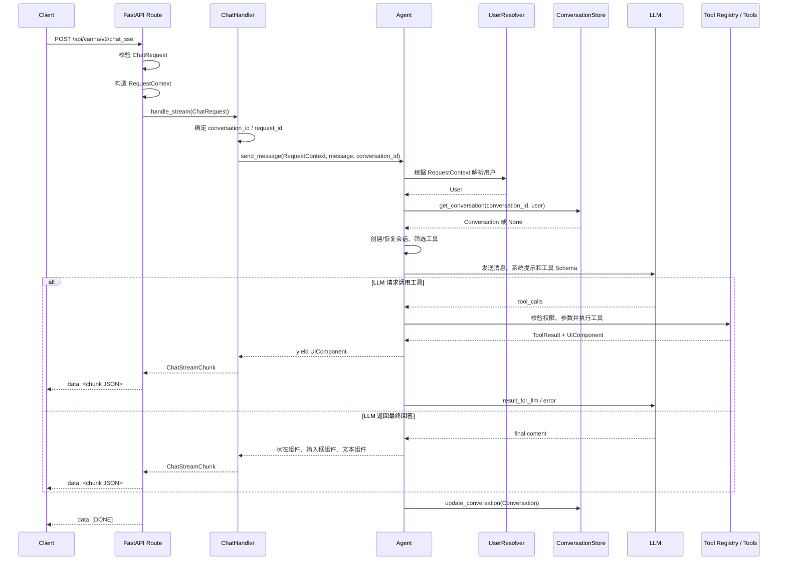
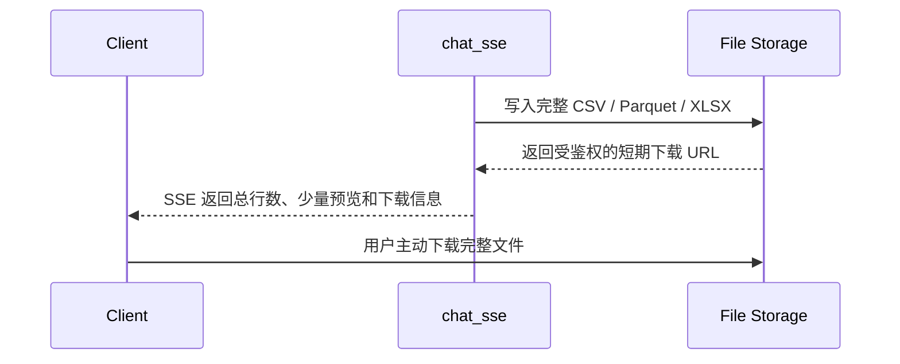

# `chat_sse` API 与处理说明

本文说明 Vanna 3.0.0 中 FastAPI 版本 `chat_sse` 接口的请求、SSE 响应、后端处理流程、对话历史设计、内置 WebComponent 前端处理方式，以及当前的大数据与文件返回边界。

项目当前 FastAPI HTTP 接口的索引和公共协议见 [API 总览](./README.md)。

> 本文描述的是当前实现。文末的改进建议不代表现有接口已经具备对应能力。

## 1. 接口概览

| 项目 | 说明 |
| --- | --- |
| Method | `POST` |
| Path | `/api/vanna/v2/chat_sse` |
| Request Content-Type | `application/json` |
| 推荐 Accept | `text/event-stream` |
| Response Content-Type | `text/event-stream` |
| 流协议 | Server-Sent Events，使用 `data:` 帧 |
| 正常结束 | `data: [DONE]\n\n` |

该接口使用 `POST + fetch + ReadableStream` 消费 SSE，不是浏览器原生 `EventSource`。原生 `EventSource` 只支持 GET，不能直接用于本接口。

认证方式不由该接口固定。服务端会将请求 Header、Cookie、来源 IP 和 Query Parameters 封装为 `RequestContext`，再交给应用配置的 `UserResolver` 解析用户身份。

实现位置：

- [FastAPI 路由](../../src/vanna/servers/fastapi/routes.py)
- [请求与响应模型](../../src/vanna/servers/base/models.py)
- [RequestContext](../../src/vanna/core/user/request_context.py)

## 2. Request

### 2.1 Headers

```http
Content-Type: application/json
Accept: text/event-stream
Authorization: Bearer <token>
```

路由本身不强制要求 `Accept: text/event-stream`，但客户端应发送该 Header，以明确期望 SSE 响应。是否需要 `Authorization` 及其具体格式由 `UserResolver` 决定。

### 2.2 Body

```json
{
  "message": "查询最近 30 天的销售额",
  "conversation_id": "conv_12345678",
  "request_id": "f20e8b37-5dbc-40d4-8a06-f3a877850ac7",
  "metadata": {
    "source": "web"
  }
}
```

| 字段 | 类型 | 必填 | 默认值 | 说明 |
| --- | --- | --- | --- | --- |
| `message` | `string` | 是 | 无 | 用户消息。没有长度和非空校验，空串或纯空白是合法值。 |
| `conversation_id` | `string \| null` | 否 | 自动生成 | 用于关联同一用户的多轮会话。缺失、`null` 或空串时，生成 `conv_` 加 8 位十六进制字符。后续请求应复用该值，详细加载逻辑见[第 5 章](#5-对话历史设计存储与加载)。 |
| `request_id` | `string \| null` | 否 | 自动生成 | 用于关联本次 SSE 响应。缺失、`null` 或空串时生成 UUID。 |
| `metadata` | `object` | 否 | `{}` | 业务扩展信息，同时进入服务端构造的 `RequestContext.metadata`。 |

请求模型中还存在 `request_context` 字段，但它是服务端保留字段，不应由客户端设置。FastAPI 完成 Body 校验后，会使用真实 HTTP 请求信息覆盖该字段：

```text
request_context.cookies      <- HTTP Cookie
request_context.headers      <- HTTP Headers
request_context.remote_addr  <- 客户端 IP
request_context.query_params <- URL Query Parameters
request_context.metadata     <- Body metadata
```

客户端也不应使用 `user_id` 代替认证信息。内置前端 TypeScript 类型虽然声明了可选 `user_id`，但后端 `ChatRequest` 没有该字段；用户身份应由 `UserResolver` 根据可信的 Header、Cookie 等信息解析。

### 2.3 空消息与 Starter UI

以下任一条件会被 Agent 识别为 Starter UI 请求：

- `message` 为空或仅包含空白；
- `metadata.starter_ui_request` 为 `true`。

内置 `<vanna-chat>` 初始化时发送：

```json
{
  "message": "",
  "conversation_id": "<当前会话 ID>",
  "request_id": "<本次请求 ID>",
  "metadata": {
    "starter_ui_request": true
  }
}
```

Starter UI 请求会加载或创建 Conversation，但不会把空 `message` 追加为用户历史。`auto_save_conversations=true` 时，空 Conversation 也可能被保存。如果 Workflow 没有生成 Starter UI 组件，响应可能只有 `[DONE]`；此时客户端无法从响应中取得服务端自动生成的 `conversation_id`。

### 2.4 cURL 示例

`-N` 用于关闭 curl 的输出缓冲，以便立即看到 SSE 帧。

```bash
curl -N \
  -X POST 'http://127.0.0.1:8000/api/vanna/v2/chat_sse' \
  -H 'Content-Type: application/json' \
  -H 'Accept: text/event-stream' \
  -H 'Authorization: Bearer example-token' \
  --data '{
    "message": "按月份汇总今年销售额",
    "conversation_id": "conv_12345678",
    "request_id": "f20e8b37-5dbc-40d4-8a06-f3a877850ac7",
    "metadata": {}
  }'
```

## 3. Response

### 3.1 HTTP 响应

正常情况下接口返回 HTTP 200，并设置：

```http
Content-Type: text/event-stream
Cache-Control: no-cache
Connection: keep-alive
X-Accel-Buffering: no
```

`X-Accel-Buffering: no` 用于提示 Nginx 等代理不要缓存整段响应。

### 3.2 SSE 帧格式

每个组件对应一条默认类型的 SSE `data:` 帧：

```text
data: <JSON payload>

```

当前协议没有使用 `event:`、`id:`、`retry:` 或 heartbeat 帧。客户端不能假设 chunk 的数量、顺序或组件类型固定，应持续读取到 `[DONE]`。

### 3.3 正常 Chunk

```json
{
  "rich": {
    "id": "d36ef463-b5b8-42a1-8ad0-0bdf00cb82ca",
    "type": "text",
    "lifecycle": "create",
    "children": [],
    "timestamp": "2026-08-29T13:00:00.000000",
    "visible": true,
    "interactive": false,
    "data": {
      "content": "今年销售额为 1,250 万元。",
      "markdown": true,
      "code_language": null,
      "font_size": null,
      "font_weight": null,
      "text_align": null
    }
  },
  "simple": {
    "type": "text",
    "semantic_type": null,
    "metadata": null,
    "text": "今年销售额为 1,250 万元。"
  },
  "conversation_id": "conv_12345678",
  "request_id": "f20e8b37-5dbc-40d4-8a06-f3a877850ac7",
  "timestamp": 1788008400.123
}
```

顶层字段：

| 字段 | 类型 | 说明 |
| --- | --- | --- |
| `rich` | `object` | 面向支持 Rich Component 的客户端，始终存在。 |
| `simple` | `object \| null` | 面向基础客户端的简化表示；不是所有组件都有。 |
| `conversation_id` | `string` | 本次请求实际使用的会话 ID。 |
| `request_id` | `string` | 本次 SSE 响应的关联 ID。 |
| `timestamp` | `number` | Chunk 创建时间，Unix epoch 秒。 |

`rich` 公共字段：

| 字段 | 类型 | 说明 |
| --- | --- | --- |
| `id` | `string` | 组件 ID。 |
| `type` | `string` | 组件类型，例如 `text`、`dataframe`、`chart`、`status_card`。 |
| `lifecycle` | `string` | `create`、`update`、`replace` 或 `remove`。 |
| `data` | `object` | 组件专属数据。 |
| `children` | `string[]` | 子组件 ID。 |
| `timestamp` | `string` | 组件时间戳，ISO 格式字符串。 |
| `visible` | `boolean` | 是否可见。 |
| `interactive` | `boolean` | 是否可交互。 |

常见 `rich.type` 包括：

```text
text, card, status_card, dataframe, chart, notification,
task_list, progress_bar, button, button_group, artifact,
status_bar_update, task_tracker_update, chat_input_update
```

客户端应允许出现自定义或新增类型。内置前端会对未知类型显示原始 JSON fallback。

### 3.4 DataFrame Chunk

DataFrame 的行数据位于 `rich.data.data`，不是 `rich.data.rows`：

```text
data: {"rich":{"id":"...","type":"dataframe","lifecycle":"create","children":[],"timestamp":"...","visible":true,"interactive":false,"data":{"data":[{"month":"2026-01","sales":120000},{"month":"2026-02","sales":135000}],"columns":["month","sales"],"title":"Query Results","description":"SQL query returned 2 rows with 2 columns","row_count":2,"column_count":2,"max_rows_displayed":100,"searchable":true,"sortable":true,"filterable":true,"exportable":true,"striped":true,"bordered":true,"compact":false,"paginated":true,"page_size":25,"column_types":{}}},"simple":{"type":"text","semantic_type":null,"metadata":null,"text":"month,sales\n2026-01,120000\n2026-02,135000\n\nResults saved to file: query_results_ab12cd34.csv"},"conversation_id":"conv_12345678","request_id":"f20e8b37-5dbc-40d4-8a06-f3a877850ac7","timestamp":1788008400.123}

```

`max_rows_displayed` 和 `page_size` 是组件展示配置，不会限制接口实际传输的行数。

### 3.5 正常结束

所有正常组件发送完成后，服务端输出：

```text
data: [DONE]

```

`[DONE]` 不是 JSON，也没有单独的 completion chunk。客户端收到后应结束读取并保留已处理的组件。

### 3.6 错误处理

错误分为三类：

| 阶段 | HTTP 状态 | 返回形式 | 是否有 `[DONE]` |
| --- | --- | --- | --- |
| Request 校验失败 | 通常为 422 | FastAPI 标准 JSON 错误响应 | 否 |
| Agent 内部异常 | 通常仍为 200 | 普通 Rich Component，例如错误 `status_card`、状态栏和输入框更新 | 是 |
| 路由流生成异常 | 流已开始时通常仍为 200 | 特殊顶层 error payload | 否 |

路由流生成异常的 payload：

```text
data: {"type":"error","data":{"message":"error message"},"conversation_id":"conv_12345678","request_id":"f20e8b37-5dbc-40d4-8a06-f3a877850ac7"}

```

该 payload 不符合正常 `ChatStreamChunk` 结构：它没有 `rich`、`simple` 和 `timestamp`。自定义客户端应先判断 `payload.type === "error"`，再按正常 chunk 解析。

如果客户端未传入 ID，且异常发生在 Handler 生成 ID 之后，错误 payload 中的 ID 仍可能为空或与之前收到的 chunk 不一致。这是当前实现限制。

## 4. 后端处理流程



### 4.1 路由与上下文

1. FastAPI 根据 `ChatRequest` 校验 JSON Body。
2. 路由从 HTTP 请求提取 Cookie、Header、客户端 IP 和 Query Parameters。
3. Body 中的 `metadata` 与这些信息共同构成 `RequestContext`。
4. 路由返回 `StreamingResponse`，迭代 `ChatHandler.handle_stream()`。
5. 每个 `ChatStreamChunk` 使用 Pydantic 序列化为 JSON，并写入一个 SSE `data:` 帧。

### 4.2 ChatHandler

1. 复用或生成 `conversation_id`。
2. 复用或生成响应关联用的 `request_id`。
3. 调用 `Agent.send_message()`。
4. 将 Agent 产生的每个 `UiComponent` 转换成 `ChatStreamChunk`。

注意：当前 `ChatHandler` 没有把客户端 `request_id` 传入 Agent。Agent 会为 ToolContext、工具调用和审计另外生成内部 UUID。因此顶层 `request_id` 应理解为客户端和 SSE 响应之间的关联 ID，而不是严格的端到端 Trace ID。

### 4.3 Agent

常规消息的主要流程如下：

1. 使用 `UserResolver` 从 `RequestContext` 解析用户。
2. 运行消息前置 Lifecycle Hooks。
3. 加载或创建当前用户的 Conversation，并根据处理分支追加历史消息。
4. 构建 ToolContext，获取当前用户有权限访问的工具 Schema。
5. 构建并增强 System Prompt 和 LLM Request。
6. 进入 LLM/Tool 循环，默认最多执行 10 轮工具调用。
7. 工具调用按顺序执行；成功结果的 `result_for_llm` 或失败信息会作为 `role=tool` 消息回传给 LLM。
8. 工具产生的 `UiComponent`、状态更新和最终文本组件依次输出。
9. 默认保存 Conversation，再运行消息后置 Lifecycle Hooks；详细生命周期见[第 5 章](#5-对话历史设计存储与加载)。

Agent 也允许 Workflow 在调用 LLM 前直接处理消息并输出组件，例如 Starter UI。

### 4.4 Rich Component 序列化

后端组件模型中的公共字段保留在 `rich` 顶层；组件专属字段统一移动到 `rich.data`。

DataFrame 是一个特例：Python 组件的 `rows` 字段会序列化成 `rich.data.data`，其余字段如 `columns`、`row_count`、`max_rows_displayed` 仍放在 `rich.data` 下。

### 4.5 RunSql 数据链路

非空 SELECT 查询的处理过程：

1. `SqlRunner` 返回完整 pandas DataFrame。
2. `RunSqlTool` 对完整 DataFrame 执行 `to_dict("records")`。
3. 完整 records 被放入 Rich `DataFrameComponent`，最终随 SSE 发送。
4. 完整 DataFrame 同时转换为 CSV，并写入按用户隔离的 FileSystem：`query_results_<8位ID>.csv`。
5. 给 LLM 的 `result_for_llm` 包含 CSV 文本预览和内部文件名；CSV 超过 1000 个字符时，仅保留前 1000 个字符并追加截断提示。
6. `simple` fallback 使用同一段文本；Rich DataFrame 不受 1000 字符限制。
7. 自定义下游文件工具仍可按文件名读取完整 CSV；3.0 不再内置图表生成工具。

该内部 CSV 不是 HTTP 附件，也没有对应的 V2 下载 URL。

实现位置：

- [Agent](../../src/vanna/core/agent/agent.py)
- [ToolRegistry](../../src/vanna/core/registry.py)
- [RunSqlTool](../../src/vanna/tools/run_sql.py)
- [Rich Component 序列化](../../src/vanna/core/rich_component.py)
- [DataFrameComponent](../../src/vanna/components/rich/data/dataframe.py)

## 5. 对话历史设计、存储与加载

`chat_sse` 中的 Conversation 主要用于恢复多轮 LLM 上下文。它不是前端聊天记录接口，也不会保存可直接重放的 Rich Component 树。客户端复用 `conversation_id` 时，后端可以继续同一会话；但刷新页面后恢复历史 UI，需要额外的查询接口和前端 hydration 逻辑。

实现位置：

- [Conversation 与 Message 模型](../../src/vanna/core/storage/models.py)
- [ConversationStore 抽象接口](../../src/vanna/core/storage/base.py)
- [MemoryConversationStore](../../src/vanna/integrations/local/storage.py)
- [FileSystemConversationStore](../../src/vanna/integrations/local/file_system_conversation_store.py)
- [ConversationFilter](../../src/vanna/core/filter/base.py)

### 5.1 数据模型与职责边界

Conversation 的核心字段：

| 字段 | 说明 |
| --- | --- |
| `id` | 会话 ID，即请求中的 `conversation_id`。 |
| `user` | `UserResolver` 解析出的完整用户对象。 |
| `messages` | 按顺序保存的 `Message` 列表。 |
| `created_at` / `updated_at` | 创建和最近追加消息的时间。 |
| `metadata` | 会话级扩展信息；当前 `chat_sse` 不会自动写入请求 `metadata`。 |

Message 的核心字段包括 `role`、`content`、`timestamp`、`metadata`、`tool_calls` 和 `tool_call_id`。当前常规 Agent 流程实际写入的内容如下：

| 会写入 Conversation | 不会自动写入 Conversation |
| --- | --- |
| 经过 `before_message` Hook 处理后的用户消息 | 每轮动态构建的 System Prompt |
| Assistant 发起的 Tool Call | SSE 输出的状态、任务、DataFrame、图表等 Rich Component |
| `role=tool` 的工具结果摘要或错误信息 | 完整 pandas DataFrame 和完整 CSV 内容 |
| LLM 的最终 Assistant 文本 | 请求 `metadata`、Cookie、Header 等 `RequestContext` 信息 |
| Workflow 通过 `conversation_mutation` 显式追加的消息 | `AgentMemory` 中的长期记忆 |

RunSql 的工具历史保存的是 `result_for_llm`：CSV 文本超过 1000 个字符时，只保存前 1000 个字符、截断提示和内部文件名。1000 字符限制因此只影响给 LLM 和 `simple` fallback 的文本预览，不限制 Rich DataFrame 的 SSE 行数，也不是 Conversation 消息条数限制。

需要区分三类状态：

- Conversation history：当前会话的用户、Assistant 和 Tool 消息，用于后续轮次的 LLM 上下文。
- AgentMemory：跨会话的长期记忆；默认上下文增强器可从中选择最多 5 条相关记忆加入 System Prompt，它不属于 Conversation。
- Rich UI state：当前页面渲染的组件状态；当前 Store 不持久化这部分内容。

### 5.2 `conversation_id`、用户隔离与加载

一次请求的加载顺序是：

1. `ChatHandler` 复用客户端提供的 `conversation_id`；缺失或为空时生成新 ID。
2. Agent 先通过 `UserResolver` 从可信的 `RequestContext` 解析当前用户。
3. Agent 调用 `get_conversation(conversation_id, user)`。
4. Store 返回同一用户的 Conversation，或在不存在、用户不匹配时返回 `None`。
5. 返回 `None` 时，Agent 先在内存中构造空 Conversation。常规消息分支会用 `update_conversation()` 将其作为 upsert 保存，并不调用 `create_conversation()`。

因此，自定义 Store 不能假设 `update_conversation()` 只更新已存在记录；它必须能够安全地创建新记录，并在写入时再次校验所有权。

两个内置 Store 都以 `conversation_id` 作为全局键或目录名，而不是以 `(user_id, conversation_id)` 作为复合键。`MemoryConversationStore` 读取时会检查 `user.id`，但写入时不会复核已有记录的所有权。`FileSystemConversationStore` 会在覆盖已有元数据前核对所有者，不同用户不能写入同一个 ID。客户端仍应生成不可预测的高熵 ID；生产 Store 建议使用 `(tenant_id, user_id, conversation_id)` 唯一约束，并在每次读写时执行服务端所有权校验。

`FileSystemConversationStore` 会把解析后的会话目录限制为 `base_dir` 的直接子目录，从而拒绝绝对路径、嵌套路径、路径穿越和指向目录外的符号链接。构造 Store 时还可以传入 `conversation_id_pattern`，对 ID 执行正则完整匹配。XPD 使用 `[A-Za-z0-9_-]{1,128}`；其他调用方也应根据自己的 ID 格式配置白名单。

### 5.3 生命周期与保存时机

不同处理分支的历史行为并不完全相同：

| 处理分支 | 加载时点 | 自动追加的消息 | 保存行为 |
| --- | --- | --- | --- |
| Starter UI | Workflow 前加载或构造 Conversation | 不追加空用户消息 | Workflow 成功时，仅在 `auto_save_conversations=true` 时 update；不运行消息前后置 Hook。 |
| Workflow 提前处理 | 当前用户消息追加前调用 Workflow | 默认不追加本轮用户消息或 Workflow 输出；仅应用显式 `conversation_mutation` | `auto_save_conversations=true` 时 update 后直接返回；不运行 `after_message`。 |
| 常规消息，新会话 | Workflow 未处理后进入 LLM 流程 | 用户消息、Tool Call、Tool 结果、最终 Assistant 文本 | 先无条件 update 一次空 Conversation，再追加消息；结束时按 `auto_save_conversations` 决定是否再次 update。 |
| 常规消息，已有会话 | Workflow 未处理后进入 LLM 流程 | 同上 | 结束时按 `auto_save_conversations` 决定是否 update。 |
| 未捕获异常 | 取决于异常发生阶段 | 可能只在进程内追加了部分消息 | 不执行常规末尾保存，也不运行 `after_message`；持久化结果取决于此前保存点和 Store 语义。 |

常规成功路径会先执行最终 `update_conversation()`，再运行 `after_message` Hook。因此，Hook 如果在原对象上修改历史，这些修改不会被当前流程再次显式保存。需要持久化的历史变更应在保存前完成，或由 Hook/自定义流程自行调用 Store。

`auto_save_conversations=false` 也不是“完全不写入”的严格保证：新建常规会话仍会先保存空 Conversation。对于已有会话，Memory Store 返回同一个可变对象引用，后续 append 可能立即反映在内存字典中；File Store 则只有显式 update 才落盘。若业务要求明确的保存边界，建议自定义 Store 返回副本，并把新建、追加和提交放入一致的事务模型。

### 5.4 历史如何进入 LLM 上下文

每次构建 LLM Request 时，处理链如下：

```text
conversation.messages
  -> 按配置顺序执行 conversation_filters
  -> 转换为 LlmMessage(role/content/tool_calls/tool_call_id)
  -> 执行 llm_context_enhancer
  -> 调用 LLM
```

工具循环中的每一轮都会重新构建请求，因此新加入的 Tool Call 和 Tool 结果会进入下一轮。转换为 `LlmMessage` 时不会传递 Conversation Message 的 `timestamp` 和 `metadata`。

默认没有 ConversationFilter，也没有内置的消息条数、字符数或 token 数截断；实际可用上限最终受模型上下文窗口、System Prompt、工具 Schema 和服务商请求限制共同约束。长会话应配置自定义 Filter，例如保留最近 N 轮、按 token 预算裁剪、摘要旧消息或移除敏感字段。

Filter 原则上只应生成“本次发送给 LLM 的视图”，不应改变持久化历史。自定义 Filter 若原地修改 Message 对象，尤其配合 Memory Store 的共享引用，仍可能污染已存会话。

### 5.5 ConversationStore 契约与内置实现

`ConversationStore` 定义了以下异步接口：

| 方法 | 用途 |
| --- | --- |
| `create_conversation(id, user, initial_message)` | 显式创建会话。当前 Agent 主流程通常不调用。 |
| `get_conversation(id, user)` | 按 ID 和用户加载单个会话。 |
| `update_conversation(conversation)` | 保存完整会话；必须兼容新会话 upsert。 |
| `delete_conversation(id, user)` | 删除指定用户的会话。 |
| `list_conversations(user, limit, offset)` | 按用户分页列出会话。 |

当前 `chat_sse` 只直接依赖加载和保存；V2 FastAPI 路由没有暴露 list/get/delete 历史 REST API。

| 特性 | `MemoryConversationStore` | `FileSystemConversationStore` |
| --- | --- | --- |
| 默认使用 | Agent 未传 Store 时使用 | 需要显式注入；XPD Factory 已默认注入 |
| 生命周期 | Agent 实例/进程内 | 本地磁盘持久化 |
| 数据布局 | `dict[conversation_id]` | 每个会话一个目录 |
| 多进程共享 | 不支持 | 共用磁盘时可见，但没有并发协调 |
| 更新语义 | 保存并返回同一个可变对象引用 | 只追加相对现有消息数量新增的尾部文件 |
| ID 与写入保护 | 无格式限制，写入不复核已有所有者 | 目录 containment；可选 ID 正则；覆盖前复核已有所有者 |
| Conversation `metadata` | 保留 | 当前不写入 `metadata.json`，重载后丢失 |
| 并发保护 | 无锁、无版本控制 | 无锁、无事务、非原子写入 |
| 清理策略 | 无 TTL，进程结束即清空 | 无 TTL、容量配额或自动清理 |

File Store 默认目录结构：

```text
conversations/
  <conversation_id>/
    metadata.json
    messages/
      <微秒时间戳>_<序号>.json
```

`metadata.json` 保存 ID、完整 User、创建时间和更新时间；每个消息文件保存 Message 的全部字段。加载时按文件名排序，损坏或无法校验的消息文件会被跳过。更新时实现会先统计已有消息，只把列表尾部的新增项写成文件，因此不能可靠持久化已有消息的修改、删除或重排。`list_conversations()` 还会扫描会话目录并加载完整消息后再分页；大量历史下成本较高。同步文件 IO 也直接运行在 async 方法中，可能阻塞事件循环。

显式启用 File Store 的方式：

```python
from vanna.core import Agent, AgentConfig
from vanna.integrations.local import FileSystemConversationStore

store = FileSystemConversationStore(
    base_dir="./conversations",
    conversation_id_pattern=r"[A-Za-z0-9_-]{1,128}",
)

agent = Agent(
    llm_service=llm_service,
    tool_registry=tool_registry,
    user_resolver=user_resolver,
    agent_memory=agent_memory,
    conversation_store=store,
    config=AgentConfig(auto_save_conversations=True),
)
```

XPD 的 `create_xpd_agent()` 已默认启用 File Store，目录固定为当前工作目录下的 `datas/history_storage`。服务重启后，只要客户端继续提交同一个合法 `conversation_id`，后端就会加载已有消息作为 LLM 上下文。该行为不提供前端历史列表或 Rich Component 回放；内置 WebComponent 刷新后仍会生成新 ID。

生产环境建议实现数据库 Store，并至少具备：复合所有权约束、写入时鉴权、乐观锁或版本号、同会话串行化、事务/原子追加、索引分页、保留期限、删除能力、静态加密和审计。当前 Agent 没有按 Conversation 加锁；同一 ID 的并发请求可能基于同一旧版本生成结果并相互覆盖或重复追加。

### 5.6 后端上下文不等于前端历史回放

当前内置 `<vanna-chat>` 在组件实例创建时生成私有 `conversation_id`，Starter 请求和后续消息会复用它；但该 ID 没有公开输入属性，也不会写入 `localStorage` 或 `sessionStorage`。页面刷新或重新挂载组件通常会生成新 ID。

即使后端 Store 中已有 Conversation，`chat_sse` 也只在生成本轮回答时读取它，不会把旧消息作为 SSE chunk 返回。内置前端没有列出会话、读取消息或把历史 hydration 到组件树的逻辑。并且 Store 保存的是 LLM Message，不是原始 Rich Component 快照，无法据此原样重建旧 DataFrame、图表、状态卡和组件生命周期。

如需面向用户的聊天历史，应额外实现：

1. 由客户端生成并持久化高熵 `conversation_id`，或提供服务端创建会话并返回 ID 的 API。
2. 提供鉴权的会话列表、消息详情、删除/归档接口，并限定只访问当前租户和用户的数据。
3. 明确历史展示模型：只把 User/Assistant 文本转换为新组件，或另存可版本化的 Rich Component/业务结果快照。
4. 前端启动时加载历史，完成去重、排序、分页和组件 hydration，再继续调用 `chat_sse`。
5. 为重试提供幂等键；当前 `request_id` 只关联响应，不会阻止相同请求重复写入历史或重复执行工具。

## 6. 前端处理说明

### 6.1 请求生成

内置 `<vanna-chat>`：

- 组件初始化后发送一次 Starter UI 请求；
- 普通消息复用当前组件实例创建时生成的私有 `conversation_id`；
- 每次请求生成新的 `request_id`；
- 使用配置的 `sse-endpoint`，默认是 `/api/vanna/v2/chat_sse`；
- 支持附加自定义 Header。

组件不会从服务端 chunk 更新、向外公开或持久化 `conversation_id`。刷新页面或重新创建组件后，通常会开始一个新会话；如需恢复历史，应由自定义前端管理 ID 和历史加载流程，参见[第 5.6 节](#56-后端上下文不等于前端历史回放)。

SSE 请求没有显式设置 `credentials: "include"`，因此 Fetch 使用浏览器默认的同源 Cookie 策略。跨域场景应优先使用自定义认证 Header，或由调用方和部署层明确配置 Cookie 与 CORS 策略。

### 6.2 SSE 读取

`VannaApiClient.streamChat()` 使用 `fetch()` 发起 POST，然后：

1. 从 `response.body` 获取 `ReadableStream` reader。
2. 使用 `TextDecoder` 增量解码字节流。
3. 使用字符串 buffer 处理跨网络 chunk 的残留文本。
4. 按换行符拆分，只处理以 `data: ` 开头的行。
5. 收到 `[DONE]` 时结束 AsyncGenerator。
6. 其他 payload 使用 `JSON.parse()` 后逐条 yield。

当前解析器会忽略 `event:`、`id:`、`retry:` 等其他 SSE 字段。单条 JSON 解析失败只记录 warning 并跳过，不会自动触发降级。

### 6.3 Chunk 与组件渲染

每个正常 chunk 会先触发可冒泡且可穿透 Shadow DOM 的 `chunk-received` 自定义事件，然后交给 `ComponentManager`：

- 同时存在 `rich.id` 和 `rich.lifecycle`：按生命周期处理；
- `rich.type === "component_update"`：作为更新协议处理；
- 其他 Rich Component：按 `create` 创建；
- UI 状态组件直接更新状态栏、任务侧栏或输入框；
- 数据、文本、图表等组件交给对应 Renderer 渲染；
- 未注册的组件类型显示原始 JSON fallback。

虽然协议包含 `simple`，当前内置 WebComponent 在存在 `rich` 时不会读取或渲染 `simple`。`simple` 主要供不支持 Rich Component 的自定义客户端使用。

SSE 只包含本次请求新产生的组件，不包含加载出的历史消息。内置前端也不会从 ConversationStore 查询或重放旧消息。

### 6.4 Polling 降级

当 SSE 请求抛出网络错误、返回非 2xx、没有响应 Body，或 `processChunk()` 抛错时，前端会把同一请求发送到 `/api/vanna/v2/chat_poll`。

该降级不是周期性轮询。服务端会等待完整处理结束，一次性返回 `ChatResponse.chunks`，前端再按顺序处理。

如果 SSE 已经成功处理部分 chunk 后连接才失败，重放同一请求可能导致：

- 已渲染组件重复；
- 会话消息重复；
- 具有外部副作用的工具重复执行。

顶层 `request_id` 当前只用于关联响应，后端没有用它做请求去重。因此具有副作用的工具应自行实现幂等控制，客户端也不应把 Polling 降级理解成断点续传。

### 6.5 DataFrame 展示与导出

内置 DataFrame Renderer 默认执行：

```ts
const displayedData = data.slice(0, max_rows_displayed); // 默认 100
```

因此：

- 默认只在 DOM 中渲染前 100 行；
- 完整 `data` 已经通过 SSE 传入浏览器；
- `page_size=25` 当前没有实现服务端或客户端分页；
- 搜索、排序和 Export 都只处理 `displayedData`；
- Export 在浏览器中创建 CSV Blob，下载固定文件名 `data.csv`；
- Export 不读取后端保存的完整 CSV，默认也只导出前 100 行。

实现位置：

- [API Client](../../frontends/webcomponent/src/services/api-client.ts)
- [`<vanna-chat>`](../../frontends/webcomponent/src/components/vanna-chat.ts)
- [Rich Component System](../../frontends/webcomponent/src/components/rich-component-system.ts)

## 7. 当前限制与建议

| 当前行为或限制 | 影响 | 建议 |
| --- | --- | --- |
| SSE 按组件输出，不按 LLM token 输出 | 最终文本通常在 LLM 完成后作为一个组件发送 | 如果需要 token streaming，需要扩展 Agent 与协议。 |
| SQL 结果没有框架级行数上限 | 大结果会完整进入 DataFrame、records、CSV、SSE JSON 和浏览器内存 | SQL 默认增加合理 `LIMIT`，汇总场景使用 `SUM`、`COUNT`、`GROUP BY`。 |
| DataFrame 展示 100 行不减少传输量 | 页面看似只显示少量数据，但网络和内存仍承担全量结果 | 后端只发送预览，并提供分页或文件下载能力。 |
| `page_size` 尚未用于真正分页 | 无法通过当前组件配置按页加载 | 新增带游标或 offset/limit 的数据接口。 |
| V2 没有完整结果下载接口 | 内部 CSV 文件名不能直接供用户下载 | 提供鉴权下载接口或对象存储短期签名 URL。 |
| 内部 CSV 没有自动过期或清理机制 | 长期运行可能积累文件 | 为结果文件设置 TTL、容量配额和定期清理。 |
| 没有 SSE heartbeat、自动重连、取消和 SSE 超时 | 长任务可能受代理空闲超时影响，客户端难以恢复 | 增加 heartbeat、AbortController 和明确的重试/幂等策略。 |
| 流内 error payload 与正常 chunk schema 不一致 | 通用客户端必须处理联合类型；当前内置前端可能忽略该错误 | 统一为正常 `rich` error component，或正式定义并实现 error union。 |
| 外部与内部使用不同 request ID | 不能直接依赖响应 `request_id` 串联全部工具与审计日志 | 将外部 request ID 传入 Agent/ToolContext，或同时暴露 trace ID。 |
| Polling 降级会重放请求 | 可能重复调用有副作用的工具 | 工具实现幂等键，并避免在收到部分结果后盲目重放。 |
| 默认 Memory Store 只在单个 Agent 进程内保存 | 重启后丢失，多 Worker 之间历史不一致 | 生产环境注入共享、持久化的数据库 Store。 |
| V2 没有会话列表、详情、删除和前端 hydration API | 后端可续接 LLM 上下文，但用户刷新页面后不能查看或恢复旧聊天 UI | 增加鉴权历史 API，并由前端持久化 ID、加载和分页渲染。 |
| 默认没有历史条数或 token 上限 | 长会话可能超过模型上下文窗口或显著增加延迟和费用 | 配置 ConversationFilter，对旧消息裁剪、摘要或分层归档。 |
| Memory Store 使用全局会话 ID，写入时不复核所有权 | ID 碰撞时可能覆盖其他用户会话或混入消息 | 使用用户复合键、高熵 ID，并在每次写入时校验所有权。 |
| File Store 只追加消息尾部 | 已有消息的修改、删除或重排无法可靠落盘 | 生产环境改用具备事务语义的 Store。 |
| 同一 Conversation 没有锁、版本号或事务 | 并发请求可能丢失更新、乱序或重复追加 | 使用乐观锁/版本号，或按会话串行处理。 |

### 推荐的大数据返回模式



推荐 SSE 仅返回：

- 查询状态；
- 总行数和列信息；
- 前 100～1000 行预览；
- 文件格式、大小、过期时间；
- 受鉴权且有时效的下载 URL。

这样可以避免把超大结果集作为单个 JSON SSE 事件发送，同时保留流式交互体验。
