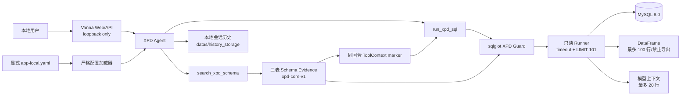

# Vanna XPD 三表适配层架构与代码设计

> 本文记录 001 期架构；服务传输层已由
> [002 精简方案](./support-xpd-tables-002.md) 收敛为 FastAPI + SSE/Polling。
> 当前包支持面和 CLI 契约以 [003 支持面精简](./support-xpd-tables-003.md) 为准。

## 1. 架构边界

XPD 能力是一个独立适配层。它复用 Vanna 的 Agent、ToolRegistry、Web/API Server、本地文件会话和 UI 组件，但不复用通用 `MySQLRunner` 或会写 CSV 的 `RunSqlTool`。这样只读、限时、限行和同回合 Schema 门禁不会被通用能力绕过。



## 2. 启动时序

1. CLI 接收显式 `--xpd-config`，与 `--example` 做互斥检查，并解析最终监听地址。
2. Loader 安全解析 YAML，只构造 `schema_version/profile/model/database` 四个字段。
3. `create_xpd_agent` 创建 `XpdSchemaCatalog` 并同步执行启动预检。
4. Catalog 一次连接读取四组 `INFORMATION_SCHEMA` 元数据，验证三张 `BASE TABLE`，构建并缓存证据。
5. Web Server 通过 `/login` 校验两个演示身份、设置 Cookie 并重定向，由服务端直接渲染登录态；`/logout` 删除 Cookie。该流程不依赖 JavaScript，但仍只是本地演示角色选择器。
6. Factory 基于同一证据创建 Guard、Runner 和两个 Tool，再创建仅接受本地演示 Cookie 的用户解析器：两个演示身份都有 `xpd` 组，`admin@example.com` 额外具有 `admin` 组。
7. Factory 注入 XPD 专属系统提示词，明确 XPD 产品身份、寒暄与身份问答口径及底层模型披露边界。普通用户消息继续交给 LLM/Tool 循环，不在 XPD 集成层做确定性问候或身份响应。
8. Factory 创建以 `datas/history_storage` 为工作目录相对路径的 File Store，并只接受 `[A-Za-z0-9_-]{1,128}` 格式的会话 ID。已存在会话的所有者不匹配时拒绝覆盖。
9. 只有以上步骤全部成功，CLI 才实例化并启动 Web/API Server。

预检失败是 fail-closed：不存在“先启动、首个请求再发现表不可用”的降级路径。

## 3. 配置模型

公共 API：

```python
load_xpd_profile(path) -> XpdProfileSettings
create_xpd_agent(settings, *, user_resolver=None, agent_memory=None) -> Agent
```

模型和数据库密钥使用 Pydantic `SecretStr`。加载错误只报告字段路径或稳定原因，不包含字段值。大模型 `base_url` 必须是无内嵌凭据、无 fragment 的 HTTPS URL。配置文件其他顶层块即使存在，也不会附着到 settings 或传入 Agent。

配置所有权仍在外部项目：本适配层不支持环境变量 fallback、默认路径、profile 合并或配置回写。

## 4. Schema Evidence

`SchemaEvidence` 是 Guard 和模型共享的唯一数据库事实来源，内容包括：

- 契约版本和数据库名；
- 三表字段名、类型、可空性、序号、清理后的注释；
- 主键、索引、真实物理外键；
- 固定业务粒度；
- 字段存在时才发布的逻辑场次关系和指标口径。

数据库注释是不可信输入。进入模型前移除控制字符、格式控制字符（包括双向文本控制），压缩空白并截断到 500 字符。

## 5. SQL Guard

Guard 使用 `sqlglot` MySQL 方言构建 AST 和 scope，执行以下检查：

- 根节点只能是单条 `SELECT`，可携带 CTE；
- 拒绝 DML、DDL、事务控制、锁、`INTO`、多语句、参数/变量、optimizer hint 和 executable comment；
- 拒绝危险函数、投影通配符、跨库/跨 catalog、未知表和任何非白名单表；
- 在每个 scope 内校验物理表、CTE/子查询输出字段、限定字段和未限定字段歧义；
- 直接物理表 JOIN 的等值列必须覆盖一条 Schema 物理外键或获批逻辑关系；
- v1 保守拒绝在派生表之间建立新的 JOIN，避免缺少完整字段血缘时绕过关系验证。

`COUNT(*)` 作为聚合语义允许；`SELECT *` 和 `table.*` 不允许。

## 6. Runner

Runner 的执行顺序固定：

1. 在调用线程中完成 Guard，得到规范化 SQL。
2. 通过 `asyncio.to_thread` 把阻塞 DB-API 操作移出事件循环。
3. 仅在建立连接失败时，按 `read_max_attempts/retry_backoff_ms` 重试。
4. 设置 `TRANSACTION READ ONLY` 和 `MAX_EXECUTION_TIME`，启动只读事务。
5. 把已验证 SQL 包装为 `SELECT * FROM (...) LIMIT 101`，只执行一次。
6. 读取最多 101 行；返回前 100 行，并用第 101 行设置 `truncated=true`。
7. 无论成功或失败均 rollback 并关闭 cursor/connection。

模型结果只序列化前 20 行。UI 组件保存最多 100 行并设置 `exportable=false`。Decimal 保留为字符串，日期时间转 ISO 8601，二进制转带 `base64:` 前缀的文本，避免不可序列化对象进入前端。

## 7. 同回合门禁

`search_xpd_schema` 不接收参数，每次调用返回完整证据，并把证据对象写入当前 `ToolContext.metadata`。Vanna 在一个用户回合的工具循环中复用该 context，在下一用户回合创建新 context，因此 marker 自然失效。

`run_xpd_sql` 首先检查 marker 和契约版本，再调用 Runner。单纯在历史对话中出现过 Schema 文本不能满足门禁，防止模型使用过期或截断的历史证据直接执行 SQL。

## 8. 错误和信息保护

适配层公开以下稳定错误代码：

| 代码 | 场景 |
| --- | --- |
| `xpd_config_invalid` | profile 解析或字段验证失败 |
| `xpd_schema_unavailable` | 启动预检失败 |
| `xpd_sql_rejected` | SQL 或同回合门禁拒绝 |
| `xpd_query_timeout` | MySQL 查询超时/被中止 |
| `xpd_database_unavailable` | 查询开始前连接重试耗尽 |
| `xpd_query_failed` | 查询执行阶段的其他失败 |

底层异常仅作为 Python exception chain 保留给进程内调试，不拼入工具结果。XPD `chat_sse` 会把接收的请求和发给客户端的全部消息记录到 `logs/xpd-chat.log`，其中可能包含问题、SQL 或查询结果，部署时必须限制日志文件访问权限；profile 密钥不会作为请求字段进入该日志。Conversation Store 会把用户、Assistant 和 Tool 消息写入 `datas/history_storage`，用于客户端复用同一会话 ID 时恢复后端上下文；它不持久化 Rich Component 树，也不提供前端历史回放。

## 9. 扩展约束

后续如需增加表、JOIN 或指标，必须升级契约版本并同时更新 Schema 证据、Guard 测试和验收用例。若要支持公网、多用户或生产环境，必须另行设计认证、授权、RLS、审计、速率限制以及共享且具备并发控制的持久化策略，不能通过放宽当前 CLI 回环限制来完成。
