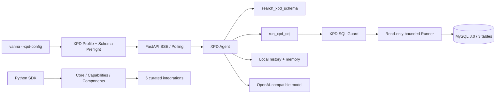

# Vanna 3.0 精简架构与代码边界

> 历史设计：组件协议部分已由 [004 三组件架构](./support-xpd-tables-004.md)
> 取代；004 删除了本文保留的 Rich/Simple 与 Chart 扩展面。

## 1. 目标架构



CLI 只装配 XPD 主链。受支持的其他 Integration 是 Python SDK 扩展点，不通过
CLI 动态发现或注册。

## 2. 包边界

```text
vanna
├── core / capabilities / components / tools
├── servers
│   └── fastapi + XPD-only CLI
└── integrations
    ├── anthropic / openai
    ├── local
    ├── mysql / sqlite
    └── xpd
```

不存在 `vanna.examples`、`vanna.legacy` 或其他内置 Integration。Flit 从
`src/vanna` 自动构建包，因而源码目录、公开 import、optional extra 和发行物
文件集必须同时满足该边界。

## 3. XPD 启动数据流

1. Click 要求显式 `--xpd-config` 并验证监听地址是回环地址。
2. Loader 严格读取 schema-v4 local profile，丢弃未批准顶层配置并保护密钥。
3. Factory 在建服前读取三表元数据，生成 Schema Evidence；预检失败即终止。
4. Factory 使用保留的 `openai`、`local` 和 XPD 专用模块装配 Agent。
5. FastAPI 只在以上步骤成功后启动，并为 XPD SSE 开启边界日志。

XPD 不复用通用 `MySQLRunner` 或 `RunSqlTool`，避免绕过 Schema 门禁、SQL Guard、
只读事务、限时限行和结果脱敏策略。

## 4. 组件与图表边界

Plotly Integration、自动图表生成器和 `VisualizeDataTool` 已删除。通用
`ChartComponent`、Rich/Simple `UiComponent` 外壳、SSE Chunk 和前端 renderer
继续保留，因此外部自定义 Tool 仍可显式返回图表数据。

`RunSqlTool` 仍支持通用 SQL Runner 和 FileSystem 扩展点，但系统提示与默认
工作流不再假设存在内置图表后处理步骤。XPD 查询继续使用自己的无导出 Tool。

## 5. 安装和版本契约

- 基础包只携带 Core、Component 和共享运行依赖。
- Integration 依赖通过同名 extra 安装；`local`、`sqlite` 使用基础依赖。
- `all` 只聚合 Anthropic、OpenAI、MySQL 和 XPD 运行依赖；不隐式安装 Server。
- XPD CLI 的完整安装命令为 `vanna[xpd,servers]`。
- Python 包版本、`vanna.__version__` 和 FastAPI OpenAPI version 均为 `3.0.0`。

## 6. 失败与兼容策略

- 删除的 import 和 extra 直接失败，不返回弃用对象或占位实现。
- 缺少受支持 Integration 依赖时，错误必须指向对应 extra。
- CLI 缺失 profile、使用公网地址、配置非法或 Schema 预检失败时不得启动服务。
- 001/002 文档是历史设计记录；003 是当前支持面和打包契约。
