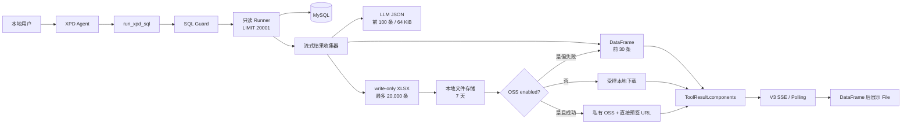

# 架构: XPD 有界查询、文件存储与 File 组件

> 对应产品需求：[005 PRD](../prds/support-xpd-tables-005.md)。
> 对应实施步骤：[005 实施计划](../plans/support-xpd-tables-005.md)。
> Cookie owner 解析已由 [006 Header 架构](./support-xpd-tables-006.md) 取代。

## 1. 架构决策

005 采用“一次查询、三个有界消费者”的架构。完整结果不进入组件或模型上下文，文件也
不通过 SSE 传输：



核心不变量：

1. 一个 Tool 调用只执行一次业务 SQL。
2. 第 20,001 条只标记截断，不进入任何消费者。
3. 内存只保留模型候选前 100 条和当前数据库批次。
4. 本地文件是生成与留存的强制事实；OSS 是配置驱动的外部分发通道。
5. File URL 不进入模型、历史或日志。

## 2. 公共组件与工具协议

### 2.1 Component

```python
class FileComponent(_ComponentModel):
    type: Literal["file"] = "file"
    name: str
    url: str
    media_type: str
    size_bytes: int
    row_count: int
    truncated: bool = False
    expires_at: datetime


Component = Annotated[
    Union[TextComponent, DataFrameComponent, FileComponent],
    Field(discriminator="type"),
]
```

- `name` 长度 1–255，拒绝 `/`、`\\`、CR/LF 和控制字符。
- `url` 沿用安全相对 URL 或 HTTP(S) URL 规则，拒绝 protocol-relative 和 active-content
  scheme。
- `media_type` 必须是无控制字符的 `type/subtype` 形式。
- `size_bytes`、`row_count` 范围为非负整数；XPD 的 `row_count` 不超过 20,000。
- `expires_at` 必须带时区并序列化为 ISO 8601。

`LinkComponent` 及其顶层、`vanna.core`、`vanna.components` 导出全部删除。公共协议仍是
三组件，而不是增加第四种类型。

`DataFrameComponent` 的公共校验上限仍为 100 条，以兼容通用 SQL Tool；XPD Tool 在
构造组件时只传前 30 条。前端校验因此仍接受最多 100 条，但 XPD 页面只会收到最多
30 条。

### 2.2 ToolResult

```python
class ToolResult(BaseModel):
    success: bool
    result_for_llm: str
    components: list[Component] = Field(default_factory=list)
    error: str | None = None
    metadata: dict[str, Any] = Field(default_factory=dict)
```

Agent 在 lifecycle hook 完成后遍历 `components`，按原顺序逐个 yield。网络层继续让每个
`ChatStreamChunk` 只携带一个 Component，因此 SSE 和 Polling wire envelope 无需修改。
Workflow 直接复用结果列表；审计只记录有序 `component_types`，不记录组件内容。

## 3. 查询执行与收集器

### 3.1 Runner 结果模型

```python
@dataclass(frozen=True)
class XpdQueryResult:
    columns: list[str]
    analysis_rows: list[dict[str, JsonScalar]]
    returned_row_count: int
    query_truncated: bool
    local_artifact: XpdFileArtifact | None
```

`analysis_rows` 最多 100 条，DataFrame 使用其前 30 条。`local_artifact` 只在结果超过
30 条且 XLSX 已原子提交时存在。

### 3.2 执行时序

1. Guard 在事件循环线程验证并规范化 SQL。
2. Runner 在 worker thread 建立 PyMySQL 连接，使用服务端游标。
3. 设置只读事务和 `MAX_EXECUTION_TIME`。
4. 执行 `SELECT * FROM (<validated SQL>) ... LIMIT 20001`。
5. 从 cursor description 固定列顺序，每次 `fetchmany(500)`。
6. 每行先交给统一正规化器；前 100 条进入 analysis buffer。
7. 收到第 31 条时创建 XLSX staging writer，并先写入缓存的前 31 条；后续行直接追加。
8. 收到第 20,001 条时设置 `query_truncated=true` 并停止消费，不写入该行。
9. 完成后关闭 workbook、原子提交文件、rollback 并关闭 cursor/connection。

任何查询或写入异常都必须走 `finally` 清理数据库资源和 staging 文件。连接建立阶段仍可
重试，业务 SQL 开始后不得重放。

### 3.3 模型负载预算

Tool 使用 compact JSON 构造以下负载：

```json
{
  "columns": ["..."],
  "rows": [],
  "returned_row_count": 20000,
  "rows_visible_to_llm": 0,
  "preview_row_count": 30,
  "query_truncated": true,
  "file_status": "available"
}
```

按顺序尝试加入最多 100 条完整 row；加入下一条后若整体超过 65,536 bytes，则撤销该行
并停止。`rows_visible_to_llm` 记录实际行数。负载不包含文件 URL、名称之外的存储标识、
本地路径、object key 或凭据。

## 4. XLSX 生成

XLSX writer 使用 openpyxl write-only workbook，以避免为 20,000 行构造完整 worksheet
对象。工作表固定为“查询结果”，首行样式、冻结窗格、筛选和列宽采用确定性配置。

值处理规则：

- null 保持空单元格；布尔、有限整数/浮点保留数值类型；
- 列名精确为 `item_id` 或 `商品ID` 的非空值按文本标识符写入并使用文本格式，避免科学
  计数法展示和 Excel 大整数精度丢失；
- Decimal 保留精度，日期时间转换为上海时区的无时区 Excel datetime；
- bytes/memoryview 转为带 `base64:` 前缀的文本；
- 其他对象转换为清理后的字符串；
- 文本去除 XLSX 禁止的控制字符，忽略前导空白后以 `= + - @` 起始时前置单引号；
- 文本超过 Excel 32,767 字符限制时安全失败，不生成损坏文件。

文件内容只表达查询结果，不增加问题、SQL、模型总结、隐藏 sheet 或宏。

## 5. 本地文件存储

### 5.1 内部模型

```python
@dataclass(frozen=True)
class XpdFileArtifact:
    file_id: UUID
    owner_id: str
    name: str
    relative_path: str
    media_type: str
    size_bytes: int
    row_count: int
    truncated: bool
    created_at: datetime
    expires_at: datetime
    oss_object_key: str | None = None
```

持久化 metadata 使用独立 schema version 和严格 JSON。owner ID 可以保存在权限受限元数据
中，目录名使用 `sha256(owner_id)[:16]`；日志和 URL 中都不出现 owner ID。

### 5.2 文件布局与原子性

```text
datas/files/
  <owner-hash>/
    <uuid>/
      result.xlsx
      metadata.json
```

staging 目录必须位于相同文件系统。提交顺序为完成 XLSX、fsync/关闭、写入临时 metadata、
设置权限、原子 rename 到最终 UUID 目录。已存在 file ID 不允许覆盖。

文件存储提供以下边界：

```python
initialize() -> None
commit(staged_path, metadata) -> XpdFileArtifact
resolve(file_id, owner_id, now) -> XpdFileArtifact
record_oss_receipt(file_id, owner_id, object_key) -> XpdFileArtifact
cleanup_expired(now) -> CleanupReport
```

`resolve` 必须重新校验 resolved path 位于 owner 目录内，且结果和 metadata 都是普通文件、
非符号链接。错误响应不暴露磁盘路径。

### 5.3 下载和过期

`GET /api/vanna/v3/files/{file_id}` 通过与聊天相同的 Cookie user resolver 获取 owner：

- UUID 畸形、文件不存在或 owner 不匹配：404；
- owner 文件 `now >= expires_at`：410，并触发 best-effort 清理；
- 成功：使用 FileResponse/StreamingResponse 返回 attachment、正确长度和安全缓存头。

FastAPI 启动时先清理一次，之后每 3,600 秒清理；shutdown 取消并 await 任务。清理器使用
metadata 的绝对过期时间而不是文件 mtime，保证重启和复制不会延长 TTL。

## 6. OSS 边界

### 6.1 配置

`XpdProfileSettings` 增加：

```text
oss:
  enabled
  endpoint
  region
  bucket
  prefix
  access_key_id
  access_key_secret
  security_token

oss_access:
  provider: oss_presign
  url_ttl_seconds
```

本地 profile 只接受 `oss_presign`。endpoint 必须是无凭据、query、fragment 的 HTTPS URL；
bucket、region、prefix 和 secret 使用严格校验。`oss.enabled=false` 时不构造 SDK client。

### 6.2 上传与签名

本地 artifact 提交后，OSS publisher：

1. 构造 `<prefix>/<YYYYMMDD>/<owner-hash>/<file-id>.xlsx`；
2. 以 private ACL、forbid-overwrite、XLSX Content-Type 和安全 Content-Disposition 上传；
3. 把稳定 object key receipt 写回本地 metadata；
4. 按配置 TTL 生成直接 GetObject 预签名 URL；
5. 构造 FileComponent，`expires_at` 使用签名返回的真实时间。

若上传失败，metadata 不含 object key；若上传成功但签名或 metadata 更新失败，执行
best-effort 补偿或保留可清理 receipt。无论哪种失败，XPD Tool 都只返回 DataFrame 和
`file_status=unavailable`，不得切换到本地 URL。

### 6.3 七天清理

本地 `artifact.expires_at` 固定为创建后 7 天，与 FileComponent 中可能只有 1 天的 OSS
URL 过期时间分离。清理时：

1. 先把 artifact 标记为过期，使下载立即不可用；
2. 删除本地 XLSX；
3. 有 object key 时删除 OSS 对象；
4. OSS 删除失败则保留最小 metadata 并记录无敏感值告警，下个小时重试；
5. 远端删除成功后移除 metadata 和空目录。

## 7. Tool 与 UI 数据流

`RunXpdSqlTool` 的成功路径：

```text
0..30 rows     -> components = [DataFrame]
31..20000 rows -> components = [DataFrame, File]
20001+ rows    -> components = [DataFrame, File(truncated=true)]
OSS failure    -> components = [DataFrame], file_status=unavailable
```

Agent 先发送 Tool components，再把不含 URL 的工具 JSON交给模型，最后发送总结 Text。因此
File 自然出现在 DataFrame 下方且在最终解释之前。OSS 失败时模型必须明确说明文件暂不可用。

前端 File 卡片显示：下载图标、“下载查询结果”、文件名、XLSX、格式化大小、文件行数和
有效期；`truncated=true` 时增加警告。相对本地 URL 直接下载，绝对 OSS URL 新窗口打开，
两者均经过运行时 URL 校验。

## 8. 安全、日志与历史

- SSE 发给浏览器的 File payload 包含真实 URL；写 XPD 日志前深拷贝 payload 并只把
  `component.type=file` 的 `url` 替换为 `<redacted>`。
- 不允许通过通用递归字符串替换处理签名 URL，避免遗漏结构或误改 wire 数据。
- OSS secret 始终使用 `SecretStr`，配置错误只报告字段路径。
- Tool metadata 可以包含内部 file ID/object key 供进程内清理，但审计、模型和会话序列化
  边界必须显式排除这些字段。
- 当前 Conversation Store 仍只保存用户、Tool 文本和最终回答，不保存组件。File URL
  不写入 Tool 文本，因此刷新后不回放，也不能从历史重新签名。
- `datas/files` 不作为 StaticFiles mount，不提供目录列表、范围外路径或任意文件读取。

## 9. 兼容性与故障语义

005 延续 3.0 尚未发布阶段的原子硬切策略：继续使用 V3 envelope，但旧 Link 类型、旧
Python import 和旧 WebComponent 不兼容。默认随 Python 包托管的 bundle 能保证版本匹配；
显式 CDN override 由部署者负责同步。

| 故障 | 对用户行为 | 文件处理 |
| --- | --- | --- |
| `datas/files` 无法初始化 | 服务不启动 | 无文件 |
| 查询/数据库失败 | 安全 XPD 错误 | 清理 staging |
| XLSX 或本地提交失败 | 展示可用预览并提示文件不可用，不重跑 SQL | 清理半成品 |
| OSS 上传失败 | DataFrame + 文件不可用提示 | 本地保留 7 天 |
| OSS 签名失败 | DataFrame + 文件不可用提示 | 本地及已上传对象保留至清理 |
| 本地 URL 过期 | owner 收到 410 | 触发/等待清理 |
| OSS URL 过期 | 浏览器下载失败；本期不续签 | 对象仍在 7 天留存期内 |
| OSS 删除失败 | 已过期且不可访问 | 每小时重试远端删除 |
