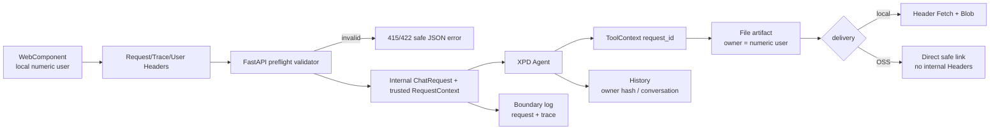

# 架构：XPD V3 Header 关联与可信身份边界

> 对应 [006 PRD](../prds/support-xpd-tables-006.md) 与
> [006 实施计划](../plans/support-xpd-tables-006.md)。

## 1. 数据流



核心不变量：

1. 调用 Agent 前，Request、Trace、User 和 Content-Type 已完成严格校验。
2. Request 是现有 V3 envelope 和 ToolContext 的唯一 request ID。
3. Trace 只描述一次 HTTP 尝试，不进入业务 payload 或历史。
4. XPD User ID 同时决定会话 owner 和 File owner，不存在 Cookie/Header 双身份。
5. 身份 Header 只能发往本服务，绝不转发到 OSS 预签域名。

## 2. 边界模型

HTTP Body 使用独立严格 DTO：

```text
ChatRequestBody(message, conversation_id?, metadata={})
```

FastAPI 依赖构造：

```text
ChatRequestHeaders(request_id, trace_id, user_id)
```

验证完成后，Adapter 构造内部 `ChatRequest(request_id=...)`，并将三个规范值写入可信
`RequestContext`。Body metadata 不能覆盖这些字段。Agent 和既有 ToolContext 继续只使用
Request ID；Trace 供 HTTP 边界日志和可观测性使用。

预检异常携带安全 status/code/message/request/trace，由统一 JSON 响应转换为现有
ChatStreamError 形状。输入 Request/Trace 无效时，诊断关联使用服务端生成值，不回显攻击者
控制的原始文本。

## 3. Header 解析

- 使用原始 ASGI Header 列表检查重复值，不能先转为 dict。
- Request/Trace 去除 HTTP 外层 OWS 后匹配安全标识格式。
- User ID 不做可能改变语义的数值格式化；只接受规范十进制并验证完整 uint64 范围
  `0..18446744073709551615`。
- Content-Type 只接受 `application/json` 媒体类型，参数单独忽略。
- Trace 完全缺失时复制有效 Request ID；空值或重复值不是“缺失”，必须拒绝。

响应 Header 由同一个不可变关联对象生成，避免 SSE、Poll 和错误分支各自计算产生分叉。

## 4. 用户与持久化

Header resolver 从可信 RequestContext 读取数值字符串，构造：

```text
User(id=<user-id>, username=xpd-user-<user-id>, groups=[xpd])
```

本地历史布局为：

```text
datas/history_storage/<sha256(user-id)前16位>/<conversation-id>/
  metadata.json
  messages/*.json
```

metadata 仍保存原始 User 并在每次读写时校验。哈希只用于目录隔离，不替代 owner 检查。
旧的根级 conversation 目录不会自动映射到新用户。

File Store 已有同类 owner hash 布局，无需迁移内容；下载路由在解析 UUID 前校验 User Header，
再通过 resolver 和 metadata owner 双重确认。

## 5. 客户端

`VannaApiClient` 的聊天调用接收 Body 与 Header 参数两个对象。协议 Header 最后构造，调用方的
customHeaders 若包含保留名称或大小写变体则立即失败。

`<vanna-chat>` 在首次 starter 前取得有效本地 User ID。每个逻辑回合创建一个 Request；SSE
和必要的 Poll 尝试各自创建 Trace。客户端验证响应 Header、SSE payload 或 Poll 根对象中的
Request 是否与当前调用一致。

相对 File URL 渲染为按钮并调用同源下载 API；绝对 HTTP(S) URL 渲染为带
`noopener noreferrer` 的新窗口链接。下载 Blob 的临时 object URL 使用后立即释放。

## 6. 日志、安全与兼容

边界日志的顶层关联字段固定为 transport、conversation_id、request_id、trace_id；payload
只记录 Body 或响应包络。不得记录 Cookie、Authorization、原始 Header 集、用户 ID 或 OSS
签名 URL。

`X-User-Id` 不验证身份真实性。CLI 继续拒绝非回环监听；未来接入网关时，网关必须完成认证并
覆盖该 Header。

006 不实现 Request 幂等。SSE 在收到首个有效 payload 前失败时仍可能回退 Poll 并造成重复
执行；相同 Request ID 只提供关联，不抑制第二次执行。
