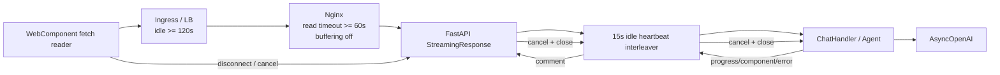

# 架构：SSE 心跳、异步上游与代理边界

> 对应 [007 PRD](../prds/support-xpd-tables-007.md) 与
> [007 实施计划](../plans/support-xpd-tables-007.md)。

## 1. 数据流



Heartbeat 是 HTTP/SSE adapter 的职责。ChatHandler 只产生业务事件，Polling 继续直接等待
完整结果，Agent、历史与模型上下文均不知道 heartbeat 的存在。

## 2. 调度状态机

```text
start pending __anext__
        |
        +-- item ready ------> yield business frame ------> start next pending read
        |
        +-- 15s timeout -----> yield ": heartbeat\n\n" ---> keep same pending read
        |
        +-- StopAsyncIteration -> yield [DONE] -> close
        |
        +-- Exception ---------> safe error + [DONE] -> close
        |
        +-- CancelledError ----> cancel/await pending + aclose -> no wire error
```

不能对每次 `__anext__()` 直接调用会取消 awaitable 的 `wait_for`。否则第一次 timeout
可能关闭上游 async generator，心跳之后永远收不到真实结果。实现只创建一个读取 task，
并让多个 heartbeat timeout 复用它。

当业务 task 与 timeout 在同一 event-loop turn 就绪时，以 task 完成为准。计时从上一条
frame 交给 ASGI 后重新开始，因此业务流量本身具有保活效果。

## 3. 非阻塞上游

路由定时器和模型调用运行在同一个 Uvicorn event loop。原同步 OpenAI 客户端会在连接、
首包和流式 `next()` 时阻塞该 loop，使独立 heartbeat task 也无法运行。

公共 OpenAI adapter 改用 `AsyncOpenAI`：

```text
send_request:   await chat.completions.create(stream=False)
stream_request: await chat.completions.create(stream=True)
                async for event in stream
                await stream.close()
```

XPD MySQL 查询已通过 `asyncio.to_thread` 隔离。其他自定义扩展仍必须保证 async 方法不会
直接执行长时间同步 I/O 或 CPU 工作；007 不尝试在线程中运行整个任意 Agent，因为这会破坏
事件循环归属、Context、取消和流式背压语义。

## 4. 客户端与取消

WebComponent 以 fetch + `ReadableStream` 消费 POST SSE。parser 仅组合 `data:` 行，
所以纯 comment block 返回空结果，不触发 envelope 校验、UI progress 或
`receivedPayload=true`。

生成器的 `finally` 对 reader 执行 best-effort cancel，再 release lock。正常 `[DONE]`、
协议异常和调用方 break 都使用同一清理路径。浏览器取消使 ASGI disconnect listener 取消
StreamingResponse；服务端 interleaver 再把取消传给 pending Agent/模型流。

## 5. 代理配置矩阵

| 层 | 配置 | 要求 |
| --- | --- | --- |
| 应用 | heartbeat interval | 固定 15 秒空闲 |
| 应用响应 | `X-Accel-Buffering: no` | 保留 |
| Nginx | `proxy_read_timeout 60s` | idle/read timeout，不是总时长 |
| Nginx | `proxy_buffering off` | 必须处理上游 no-buffer Header |
| Ingress-Nginx | `proxy-read-timeout: "120"` | SSE path 显式设置 |
| Ingress-Nginx | `proxy-buffering: "off"` | 防止小 comment 聚合 |
| 云 LB | idle timeout >= 120s | 厂商配置；拒绝误用 absolute duration |

参考 Nginx location：

```nginx
location /api/vanna/v3/chat_sse {
    proxy_pass http://vanna_upstream;
    proxy_http_version 1.1;
    proxy_read_timeout 60s;
    proxy_buffering off;
}
```

参考 Ingress-Nginx annotation：

```yaml
nginx.ingress.kubernetes.io/proxy-read-timeout: "120"
nginx.ingress.kubernetes.io/proxy-buffering: "off"
```

配置必须在真实部署仓库按实际 Controller 和云厂商实现。本仓只提供协议与验收基线。

## 6. 可观测性与兼容

XPD chat 日志继续记录 request、progress、chunk、error 和正常 done。Heartbeat 不含业务
信息且频率固定，不逐条写日志，避免每连接每分钟四条噪声。若未来需要链路活性指标，应在
独立 transport metric 中聚合，而不是扩展 chat `message_type`。

标准 SSE 客户端会忽略 comment。非标准客户端若假设每个空行分隔块都是 JSON，需要按
SSE 语法修复。Heartbeat 不改变 Request/Trace、fallback、幂等或完成信号。
